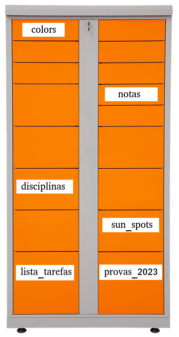

```{r setup, include=FALSE}
options(
  htmltools.dir.version = TRUE, formatR.indent = 2, width = 55, digits = 4
)
```

```{r cite-packages, include = FALSE}
# automatically create a bib database for R packages
# add any packages you want to cite here
knitr::write_bib(c(
  .packages(), 'bookdown', 'webexercises'
), 'packages.bib')

```

```{r, echo = FALSE, results='asis'}
# Uncomment to change widget colours:
#style_widgets(incorrect = "goldenrod", correct = "purple", highlight = "firebrick")
```

# Sobre {.unnumbered}

Sejam bem vind\@s!

<p class="jst"> Este material online pretende trazer conteúdos complementares e exercícios para reforçar o aprendizado dos assuntos apresentados nas aulas. O mesmo será produzido conforme formos avançando no curso, portanto, fique livre para fazer sugestões. </p>

# Tópico - Objetos

<p class="jst"><b>Vimos em aula que tudo no R é um objeto.</b> Além disso, vimos que objetos tem diferentes tipos (ex: numeric, integer, character, logical, function ...). No entanto, quando digitamos algum dado no console do RStudio como um número (ex: 7) ou um texto (ex: "abacate"), esses objetos não são armazenados no R automaticamente. Como desejamos trabalhar com dados de forma automatizada, precisamos indicar para o R para manter esses dados na memória do computador. Fazemos isso indicando nome e valor para um objeto, na forma:</p>

::: {.content-box-green .center .large style="color: blue;"}
nome_do_objeto \<- valor
:::

<p class="jst"> <b>Pense nesse caso da seguinte forma:</b> o R trata a memória do computador como se fosse um armário gigantesco, cheio de gavetas. Queremos guardar itens (dados) diferentes nessas gavetas. Para termos organização, precisamos dar nomes diferentes e intuitivos para cada uma das gavetas disponíveis que pretendemos usar. Isso facilitará o acesso aos nossos itens.</p>

```{r echo=FALSE, out.width = "50%", out.height= "20%", fig.align = "center"}

```

<p class="jst"> Bom, o R também nos impõe uma restrição. Não podemos guardar itens diferentes na mesma gaveta, sendo que cada uma delas aceita apenas um tipo específico de item. Ainda assim, o armário do R consegue representar uma quantidade suficiente de tipos de itens dentre os quais desejaremos guardar e, geralmente, tem espaço de sobra.</p>


::: {.content-box-gray .center .xlarge style="color: black;"}
Perfeito, sigamos com uma lista de exercícios.
:::

## Exercícios básicos

### Escolha uma alternativa para cada afirmação:

- O operador usado para atribuir valores em objetos é: `r mcq(c("assign()", ":", answer = "<-", "?"))`

- Eu uso `r mcq(c("<-", answer = "help(\">=\")", "=", answer = "?\">=\"", "nenhuma opção"))` para obter informação sobre o operador lógico **>=**.

- Com a função `class()` eu posso descobrir o `r mcq(c("tamanho", "nome", "comportamento", answer =  "tipo"))` de um objeto.

- Os objetos que criamos ficam listados e disponíveis na aba `r mcq(c("Console", "Pacotes", "Ajuda", answer = "Ambiente", "em nenhuma aba"))` do RStudio.

### Complete as sentenças ou responda conforme os enunciados:

- Qual operador permite que um objeto receba dados? `r fitb(c("<-", "->", "="))`

- Armazene o valor 2 no objeto `number` usando o operador de atribuição : `r fitb(c("number <- 2", "2 -> number", "number = 2"), ignore_ws = FALSE)`

- Na aba **Histórico** do RStudio são listados os `r fitb("comandos", ignore_case = TRUE, width = "10")`  enviados ao R.

- Digite um operador de comparação: `r fitb(c("<", ">", "<=", ">=" , "==", "!="))`

- Digite um operador aritmético: `r fitb(c("+", "-", "*", "/", "^" , "%%", "%/%"))`

- Digite um operador lógico: `r fitb(c("!", "&", "&&", "|", "||" , "xor", "isTRUE", "isFALSE"))`

### Teste um nome para um objeto

<p class="jst">Existem "boas páticas" que ajudam na clareza de código. Algumas se referem a forma "ideal" de nomear objetos. No próximo campo, você pode testar nomes de objetos. Obs: de preferência a nomes intuitivos e curtos.</p>

::: {.center .xlarge style="color: black;"}
 `r fitb("^[a-z-_]+$", width = 25, ignore_ws = FALSE, regex = TRUE)`
:::

### Armazene dados na forma `nome_do_objeto <- valor`

- Um número real

`r fitb("^[a-z-_]+$", width = 20, ignore_ws = FALSE, regex = TRUE)`  `r fitb("<-", width = 2, regex = TRUE)`  `r fitb("^[+-]?([0-9]*[.])?[0-9]+$", width = 10, regex = TRUE)`

- Um número inteiro

`r fitb("^[a-z-_]+$", width = 20, ignore_ws = FALSE, regex = TRUE)`  `r fitb("<-", width = 2, regex = TRUE)`  `r fitb("^[0-9]+L$", width = 10, regex = TRUE)`

- Um valor lógico

`r fitb("^[a-z-_]+$", width = 20, ignore_ws = FALSE, regex = TRUE)`  `r fitb("<-", width = 2, regex = TRUE)`  `r fitb(c("TRUE", "FALSE", "T", "F"),width = 20, regex = FALSE)`

- Um texto

`r fitb("^[a-z-_]+$", width = 20, ignore_ws = FALSE, regex = TRUE)`  `r fitb("<-", width = 2, regex = TRUE)`  `r fitb("^[\"][a-zA-ZÀ-ú0-9\r!@#$%^&*()_+-=?',;.:/}{~´]+\"$", width = 45, regex = TRUE)`

### O seguinte comando executado no console:

```{r, eval=FALSE}
ditado_popular <- "De grâo em grão a galinha enche o papo
```

```{r, echo = FALSE}
opts_p <- c(
   "Imprime o texto do ditado popular.",
   answer = 'Vai fazer o  R aguardar `"` ser digitado. As aspas duplas ou simples tem a função de delimitar textos. Para isso é necessário sempre indicar o inicio e final do texto, abrindo e fechando com `"`.',
   "Gera um erro interno no R.",
   "Nenhuma das alternativas."
)
```

`r longmcq(opts_p)`


### O seguinte comando executado no console:

```{r, eval=FALSE}
minha_soma <- 1 + '1'
```

```{r, echo = FALSE}
opts_p <- c(
   'Armazena o texto "1 + 1" no objeto `minha_soma`.',
   'Vai gerar um erro. É preciso colocar o comando entre aspas duplas (" 1 + \'1\' ") para que a operação de soma seja possível.',
   answer = "Gera um erro pois não é possível fazer operação de soma entre objeto to tipo `numeric` e `character`.",
   "Nenhuma das alternativas."
)
```

`r longmcq(opts_p)`

## Exercícios intermediários

### Selecione verdadeiro (TRUE) ou falso (FALSE)

- Uma função no R também é um objeto. `r torf(TRUE)`

- `class` não faz parte dos atributos que um objeto possui. `r torf(FALSE)`

- <p class="jst"> Se dois objetos forem da mesma classe, qualquer operação disponível ao tipo desses objetos pode ser aplicada. `r torf(FALSE)` </p>

- <p class="jst"> Um objeto básico do R pode conter mais de um elemento, garantido que todos sejam do mesmo tipo. `r torf(TRUE)` </p>

- <p class="jst"> Qualquer tipo de objeto pode ser convertido para outro tipo disponível no R, resguardado que seja usado uma função de conversão existente. `r torf(FALSE)` </p>

### O seguinte comando executado no console:

```{r, eval=FALSE}
my_object <- as.numeric(paste0("0004", ".500"))
my_object
```

```{r, echo = FALSE}
opts_p <- c(
   'Imprime o texto "0004.500".',
   answer = "Vai imprimir o valor numérico 4.5 pois, após a união dos textos, é feita a conversão do objeto do tipo `character` para `numeric`.",
   "Imprime o valor inteiro 4500",
   "Vai imprimir o tipo do objeto."
)
```

`r longmcq(opts_p)`

### Concatenação de textos

<p class="jst">Forme a palavra composta alface-de-cordeiro com os elementos "alface", "de" e "cordeiro" e atribua ao objeto "palavra_composta". Para isso use a função `paste()` ou `paste0()` do R:</p>

`r fitb(c("palavra_composta <- paste(\"alface\", \"de\", \"cordeiro\", sep = \"-\")", "palavra_composta <- paste('alface', 'de', 'cordeiro', sep = '-')", "palavra_composta <- paste0(c('alface', 'de', 'cordeiro'), collapse = '-')", "palavra_composta <- paste0(c(\"alface\", \"de\", \"cordeiro\"), collapse = \"-\")"), ignore_ws = FALSE, ignore_case = FALSE)`


## Exercícios avançados

::: {.webex-check .webex-box}

**Considere um *R script* de nome `teste.R` que possui um único comando, conforme listado abaixo. Esse *script*, ao ser carregado com `source("teste.R", echo = TRUE)`:**

```{r, eval=FALSE}
(my_nunber <- (1 + 1)
```

```{r, echo = FALSE}
opts_p <- c(
    "Vai armazenar o objeto `my_number` na sessão atual do R contendo o valor 2. Esse objeto será listado na aba ambiente do RStudio.",
    answer = "Imprime um erro pois é necessário um segundo parêntese para fechamento de função. Os parênteses representam uma função primitiva do R cujo uso semântico correto é ( ... ).",
    "Imprime o comando e o valor 2.",
    "Vai fazer com que o R aguarde o fechamento dos parênteses na aba Console do RStudio."
)
```

`r longmcq(opts_p)`

**O seguinte objeto:**

```{r}
print(version)
```

```{r, echo = FALSE}
opts_p <- c(
    answer = "É um objeto do tipo lista. Uma lista pode conter itens como vetores (tipos básicos do R), matrizes, funções ou mesmo outras listas.",
    "É um arquivo com informações que o R lê automaticamente quando digitamos `version`.",
    "É uma função que imprime informações básicas sobre a versão do R instalada.",
    "Nenhuma das anteriores."
)
```

`r longmcq(opts_p)`

:::

## Nossos itens, nossas gavetas

<p class="jst">Aprofundaremos detalhes sobre estruturas de dados no R no terceiro módulo do curso. Antes disso, segue uma demostração em forma de exercício.</p>

**Armazene conjuntos de dados em objetos**

```{r echo = FALSE}
number <- 1:5
fruit <- c("abacate", "banana", "laranja")
```

- Os valores numéricos de 1 a 5 em `number`, cuja impressão mostre:

```{r echo = TRUE}
print(number)
```

- Os elementos "abacate", "banana", "laranja" em `fruit`, cuja impressão mostre:

```{r echo = TRUE}
print(fruit)
```

`r hide("Preciso de ajuda")`

Veja a documentação de  `c()`

`r unhide()`

```{r eval = FALSE, webex.hide="Clique para ver a solução"}
number <- c(1, 2, 3, 4, 5) # ou number <- seq(1, 5) ou number <- 1:5
fruit <- c("abacate", "banana", "laranja")
```
