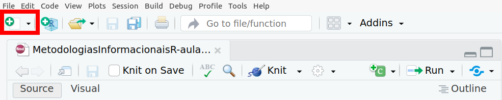
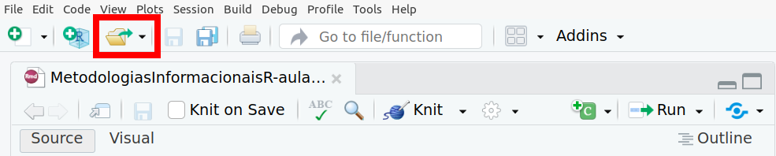
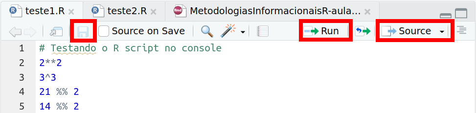
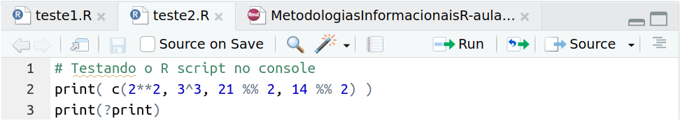

layout: true

background-image: url(figures/template_middlepage.png)
background-size: cover

```{r libririesandcustoms, include=FALSE, warning=FALSE}
  library(xaringanthemer)
  library(icons)
```

---
class: center, top

<br/><br/><br/><br/><br/><br/><br/>

.orange[<b>Telmo dos Santos Klipp</b>]

.small[
Graduação em Tecnologias da Informação e Comunicação (UFSC, 2009-2013) <br/>
Mestrado em Engenharia de Computação (FURG, 2013-2015) <br/>
Bolsista CNPq no Laboratório de Computação para Clima Espacial (LCCE/INPE, 2015-2020) <br/>
Doutorando em Computação Aplicada (INPE, 2020-atual) <br/>
]

---
### .orange[`r icons::fontawesome("info-circle")` Informações Gerais sobre o Curso]

- <p class="jst">Materiais disponibilizados via <A href="https://classroom.google.com/">Classroom</A> (entre com o código .purple[jdq7j5o]);</p>
- <p class="jst">O aprendizado requer a prática que será constante nas aulas;</p>
- <p class="jst">Será cobrado ao menos uma atividade semanal `r icon_style(fontawesome("thumbtack"), fill = "black")`.</p> 

.pull-left[
Bibliografia Básica:

 .tiny[- <p class="jst">Kennedy, R., & Waggoner, P. D. (2021). Introduction to r for social scientists: a tidy programming approach. CRC Press.</p>

```{r out.width = '48%', echo=FALSE, fig.align = "center"}
knitr::include_graphics("figures/basicblibliograph.png") 
```
]
]

.pull-right[
Bibliografia Complementar:

 .tiny[- <p class="jst">Wickham, H., & Grolemund, G. (2016). R for data science: import, tidy, transform, visualize, and model data. " O'Reilly Media, Inc.". Disponível em: <A href="https://r4ds.had.co.nz/index.html">https://r4ds.had.co.nz/index.html</A>. Acesso em: 12 de maio, 2023. (Online) </p>
- <p class="jst">Damiani, A. et. al., (2022). Ciência de Dados em R. Curso-R. Disponível em: <A href="https://livro.curso-r.com">https://livro.curso-r.com</A>. Acesso em: 12 de maio, 2023. (Online)</p>
-  <p class="jst">de Aquino, J. A. (2014). R para cientistas sociais. Editora da UESC (editus). Disponível em: <A href="http://www.uesc.br/editora/index.php?item=conteudo_livros_digitais.php">http://www.uesc.br/editora/</A>. Acesso em: 12 de maio, 2023. </p>
-  <p class="jst">de Oliveira, P. F., Guerra, S., McDonnell, R. (2018). Ciência de Dados com R: Introdução. Editora IBPAD. Disponível em: <A href="https://cdr.ibpad.com.br/index.html">https://cdr.ibpad.com.br/index.html</A>. Acesso em: 12 de maio, 2023. (Online) </p> ] 
]

---
## .orange[Gostaria de Conhecer Vocês]

.pull-left[
Dinâmica em grupo:

> <p class="jst">Por favor se apresente.<br/><br/><br/><br/></p>

]

.pull-right[
`r icon_style(fontawesome("thumbtack"), fill = "black")` Tarefa 1 para a semana:

> <p class="jst">Disponibilize um painel com informações sobre você no mural online da platafoma <A href="https://padlet.com/telmoklipp/metodologias-informacionais-com-r-z6vrutv3owtg96gx">Padlet</A>. </p>

]

---
## .orange[O que é o R?]

- <p class="jst">Ambiente integrado de recursos de <i>software</i> para manipulação, cálculo e exibição gráfica (Venables et al., 2023);</p>
- <p class="jst">Linguagem de programação multiparadigma;</p>
- <p class="jst">Desenvolvido com foco em manipulação, estatística e análise de dados;</p>
- <p class="jst">É gratuito e <i>open source</i> (código aberto); </p>
- <p class="jst"> Possui inúmeros pacotes distribuitos via  <A href="https://cran.r-project.org/"><i>The Comprehensive R Archive Network</i></A>. </p>
---
class: left, bottom

background-image: url(figures/r_atterminal.png)
background-size: contain

## .orange[O que é o R?]

---
## .orange[RStudio?]

- <p class="jst">É um ambiente de desenvolvimento integrado (IDE) para R e Python;</p>
- <p class="jst">Ferramenta que possui diversas funcionalidades como edição e depuração de código, console e histórico de comandos, gerenciamento e visualização de dados;</p>
- <p class="jst">Tem as funcionalidades distribuídas em painéis por meio de abas;</p>
- <p class="jst">É disponibilizado em versão grátis e comercial pela <A href="https://posit.co/"><i>Posit</i></A>.</p>

---

class: left, bottom

background-image: url(figures/rstudio_panels.png)
background-size: contain

## .orange[RStudio?]

---
## .orange[Por onde começar?]

- <p class="jst"> Fazer o <i>dowload</i> do R em <A href="https://cran.r-project.org/"><i>https://cran.r-project.org</i></A> e seguir os passos para instalação; </p>


- <p class="jst"> Fazer o <i>dowload</i> do RStudio em <A href="https://posit.co/download/rstudio-desktop/"><i>https://posit.co/download/rstudio-desktop</i></A> e seguir os passos para instalação.</p> 

---
### .orange[O R e o RStudio já estão instalados?]

<p class="jst">Ter as versões atualizadas do R e RStudio pode ser importante. Digite os respectivos comandos no console: .purple[version] e .purple[`rstudioapi::getVersion()`] ou .purple[`rstudioapi::versionInfo()`].</p>


```{r rbase_info}
version
```

---
class: left, top

.scroll-box-31[
```{r rstudio_info1}
rstudioapi::versionInfo()
```
]

---
## .orange[Por que usar R?]

- <p class="jst">É gratuito e <i>open source</i> (regularmente atualizado e mantido);</p>

- <p class="jst"> Aprender a usar o R não precisa ser exaustivo (amplo e fácil acesso à documentação, fóruns e .green[<b>comunidade</b>] para obter informações);</p>

- <p class="jst">Linguagem de programação e ambiente de trabalho ao mesmo tempo;</p>
- <p class="jst"> Executar tarefas de ciência de dados e estatística dispondo de várias ferramentas (distribuídas na forma de pacotes), possivelmente, direcionadas a sua área e domínio de interesse;</p>

- <p class="jst">Pelas metodologias que fundamentam alguns pacotes do R como <i>literate programming</i> (Knuth, 1992), <i>gramar of graphichs</i> (Wilkinson, 2012), entre outras abordagens.</p>

--

.pull-left[
.red[<b>Contrapontos:</b>]

- <p class="jst">Aprender a escrever código.</p>
]
--
.pull-right[
.green[<b>Porém, existem ganhos:</b>]
- Flexibilidade e controle;
- Reprodutibilidade.
]


---
background-image: url(figures/rcommunity.png)
background-size: cover
background-position: center

.left[.footnote[.small[Créditos:  <A href="https://posit.co/conference/"> posit::conf</A>.]] ]

---
## .orange[Algumas observações...]

 - <p class="jst"> O R é relativamente novo, desenvolvido no início dos anos 1990 (Ihaka e Gentleman, 1996) com base na também linguagem/ambiente S para estatística;</p> 

 - <p class="jst"> Atualmente: muitos colaboradores, materiais online, blogs e conferências (<A href="https://user2022.r-project.org/">UseR</A> , <A href="https://www.ascent.io/earl"> EARL </A>, <A href="https://posit.co/conference/"> posit::conf </A>);</p>
 
 - <p class="jst"> Vamos focar no uso de pacotes baseados em metodologias intuitivas como programação letrada e gramática de gráficos.</p> 

--
<br/><br/>

<b>.center.green.large[Então vamos realmente começar!]</b>

---
class: left, bottom

background-image: url(figures/rstudio_panels_console.png)
background-size: contain
background-position: 

.orange.xlarge[RStudio: nossa ferramenta de trabalho - `r icons::simple_icons("windowsterminal")` Console]

---
### .orange[RStudio - `r icons::simple_icons("windowsterminal")` Console]

<p class="jst"> O console é um ambiente interativo onde podemos digitar comandos (ordens) - logo após o simbolo .purple[.large[>]] (conhecido  como <i>prompt</i>) - e enviar para o R ao teclar .purple[Enter]. Os comandos são interpretados (avaliados) no mesmo instante para receber resultados. Teste alguns comandos: </p> 
  ```{r}
  1 + 1
  1+6
  "O RStudio é um ambiente de desenvolvimento integrado."
  ```

---
### .orange[RStudio - `r icons::simple_icons("windowsterminal")` Console]

Teste alguns comandos:

```{r, eval=FALSE}
{{1 + '1'}}
```

```{r, eval=FALSE}
{{(1 + 1}}
```

```{r, eval=FALSE}
{{Hoje é quarta feira!}}
```


---
### .orange[RStudio - `r icons::simple_icons("windowsterminal")` Console]

Teste alguns comandos:
  ```{r}
  2**2; 3^3; 21 %% 2; 14 %% 2;
  sqrt(25); round(2.55, digits = 1); ceiling(2.01); floor(2.99);
  ```

```{r, eval=FALSE}
{{round(sqrt(122.563^2, 2))}}
{{floor(122.563, digits = 2)}}
```

---
class: left, bottom

background-image: url(figures/rstudio_panels_ajuda.png)
background-size: contain

.orange.xlarge[RStudio: nossa ferramenta de trabalho - `r icons::fontawesome("question-circle")` Ajuda] 

---
### .orange[RStudio - `r icons::fontawesome("question-circle")` Ajuda]

<p class="jst">  Nos temos acesso à documentação e manuais com .purple[`help.start()`]. Não somente isso, a função .purple[`help()`] garante acesso à informação documentada sobre operadores (ex: aritméticos e lógicos) e estruturas de controle da linguagem R. Também sobre funções e outros objetos com exemplos de uso e funcinamento. Em sintese, .purple[`help()`]  fornece ajuda para uso do sistema R.  

<br/><br/>

Teste alguns comandos: </p>
  ```{r, eval=FALSE}
  help("%%") # ou ?"%%"
  ?sqrt # ou help(sqrt) 
  ```

---
class: left, bottom

background-image: url(figures/rstudio_panels_arquivos.png)
background-size: contain

.orange.xlarge[RStudio: nossa ferramenta de trabalho - `r icons::fontawesome("clone")` Arquivos]

---
### .orange[RStudio - `r icons::fontawesome("clone")` Arquivos]

- <p class="jst">Nesse painel ficam disponíveis os .purple[<i>scripts</i>] (arquivos de código) ou outros tipos de arquivo para edição.</p>

- <p class="jst">Crie um novo arquivo .purple[`R` <i>script</i>] (sua extensão deve ser nome_do_arquivo.purple[.R]), segundo alguma das opções:</p>


> 1. No menu principal acesse: File > New File > R script; ou

> 2. Presione Crtl + Shift + N; ou

> 3. Clique no ícone do menu secundário e selecione .purple[`R` <i>script</i>]: 
```{r out.width = '100%', echo=FALSE, fig.align = "center"}

```

---
### .orange[RStudio - `r icons::fontawesome("clone")` Arquivos]

- <p class="jst">Já possui um .purple[`R` <i>script</i>] ou outro tipo de arquivo e quer abri-lo. Faça isso segundo alguma das opções:</p>


> 1. No menu principal acesse: File > Open File e procure/selecione no diretório (pastas) o nome do arquivo; ou

> 2. Presione Crtl + O; ou

> 3. Clique no ícone do menu secundário e procure/selecione no diretório o nome do arquivo:
```{r out.width = '100%', echo=FALSE, fig.align = "center"}

```

---
### .orange[RStudio - `r icons::fontawesome("clone")` Arquivos]

- <p class="jst">Digite alguns comandos no seu .purple[`R` <i>script</i>] e salve o arquivo usando o ícone para salvar (conforme imagem abaixo ou Ctrl + S). É possível executar os comandos do  <i>script</i> um por um usando o ícone .purple[Run] ou usando o ícone .purple[Source], disponíveis no menu da aba do próprio arquivo (canto superior direito), conforme imagem abaixo: </p> 

```{r out.width = '95%', echo=FALSE, fig.align = "right"}

```

--

- <p class="jst"> Também é possível carregar o .purple[`R` <i>script</i>] usando a função .purple[`source("teste1.R")`]. Teste esse comando no console para executar seu <i>script</i>. Qual resultado será produzido? </p> 

---
### .orange[RStudio - `r icons::fontawesome("clone")` Arquivos]

- <p class="jst"> Para este segundo caso, qual resultado será produzido com .purple[`source("teste2.R")`]?</p> 

```{r out.width = '95%', echo=FALSE, fig.align = "right"}

```

--

- <p class="jst"> A função .purple[`source()`] do pacote .purple[`base`] (conhecido como R base) possui parâmetros que modificam seu funcionamento (comportamento) padrão. Teste os comandos abaixo usando seu .purple[`R` <i>script</i>]: </p> 
  ```{r, eval=FALSE}
  source("teste1.R", echo = TRUE)
  source("teste1.R", print = TRUE)
  ```
--

<br/>

> .center[Não se preocupe! Entenderemos sobre .purple[funções] e .purple[pacotes], assim como,  representação de dados no R (.purple[objetos]) durante o curso.] 

---
class: left, bottom

background-image: url(figures/rstudio_panels_ambiente.png)
background-size: contain

.orange.xlarge[RStudio: nossa ferramenta de trabalho - `r icons::fontawesome("database")` Ambiente]

---
### .orange[RStudio - `r icons::fontawesome("database")` Ambiente]

- <p class="jst">Nesta aba são listadas informações dos objetos e funções carregados no ambiente do R (sessão atual) por meio de campos. É possível interagir, bem como, importar/exportar dados e obter informações sobre alocação de memória (do computador) ou liberar memória que esta sem uso no R. </p>

- <p class="jst">Algumas dessas tarefas estão disponíveis por meio dos comandos:</p>
  ```{r, eval=FALSE}
    ls()        # listar objetos/funções
    objects()   # similar ao ls
    gc()        # liberar a memória sem uso
  ```
- <p class="jst">Ao longo do curso também veremos funções para importar/exportar dados.</p>  

--

- <p class="jst">A aba <b>Histórico</b> ao lado da aba <b>Ambiente</b> também é bastante útil. Essa aba possui o histórico de comandos executados no console. Talvez você já tenha percebido, também é possível acessar o histórico de comandos interativamente no console usando as setas `r icons::fontawesome("arrow-up")` e `r icons::fontawesome("arrow-down")` do teclado. </p> 

---

### .orange[ `r icon_style(fontawesome("thumbtack"), fill = "black")` Tarefa 2 para a semana.]

- <p class="jst"> As funções  .purple[`paste()`] e .purple[`paste0()`] do pacote .purple[base] concatenam (unem) blocos de texto (ou caracteres) conforme o exemplo abaixo:</p>
  ```{r}
  paste("Boa", "tarde!")
  ```

- Qual a diferença entre as funções .purple[`paste()`] e .purple[`paste0()`]? 


- Ao concatenarmos elementos para formar uma expressão na forma
  ```{r}
  paste("O dobro de", 2, "é", 2*2, "!")
  ```

  <p class="jst"> no resultado, é possível notar que existe um espaço entre os caracteres "4" e "!". Por que você acha que isso ocorreu? Que resultado obtemos usando .purple[`paste0()`]?  Desenvolva uma solução para a mesma concatenação, cujo resultado seja .orange[<b>"`r paste0('O dobro de ', 2, ' é ', 2*2, '!')`"</b>]. Crie um .purple[`R` <i>script</i>] que mostre o mesmo resultado ao ser carregado com .purple[`source()`].</p>


---

class: left, top

### .orange[Referências]

```{r, load_refs, echo=FALSE}
library(RefManageR)
bib <- ReadBib("./files/01-mybib.bib", check = FALSE)
generateReferences <- function(bib) {
  for(i in 1:length(bib)) {
    print(bib[i], .opts = list(check.entries = FALSE, style = "html", bib.style = "authoryear"))
  }
}
```

```{r, print_refs, results='asis', echo=FALSE, warning=FALSE, message=FALSE}
writeLines('.small[')
generateReferences(bib)
writeLines(']')
```

---
class: center, middle

background-image: url(figures/template_endpage.png)
background-size: contain

.center[.large[<b> Metotologias Informacionais com `r icon_style( icons::simple_icons("r"), scale = 2)`</b> ]]

.xxlarge[<b style="color:MidnightBlue "> Muito Obrigado pela Atenção!</b>]
