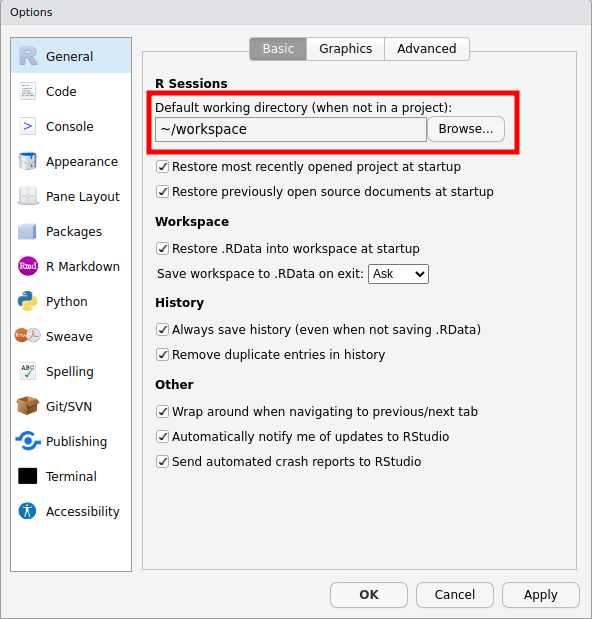
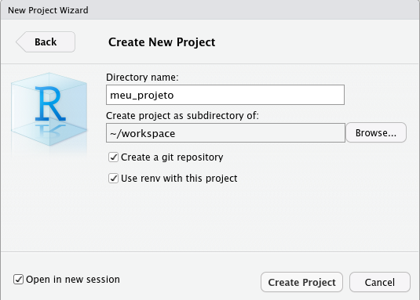
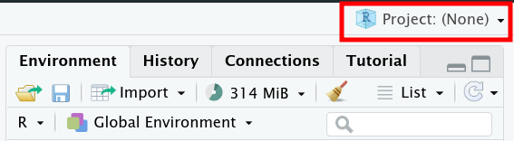
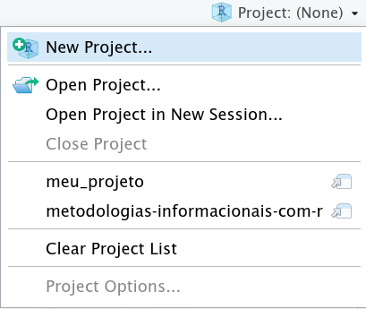
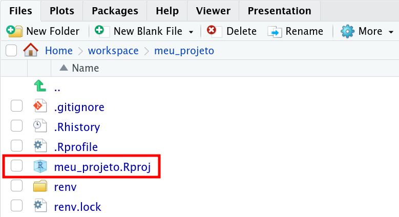
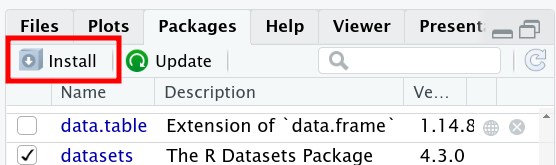
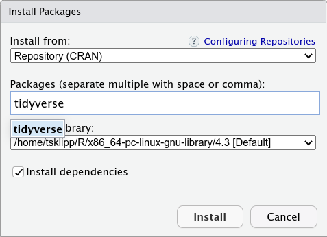
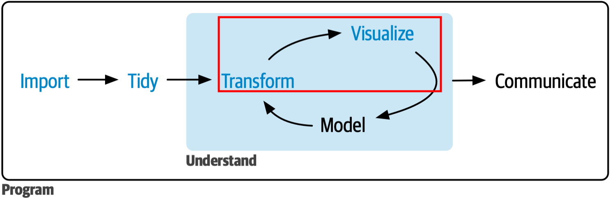
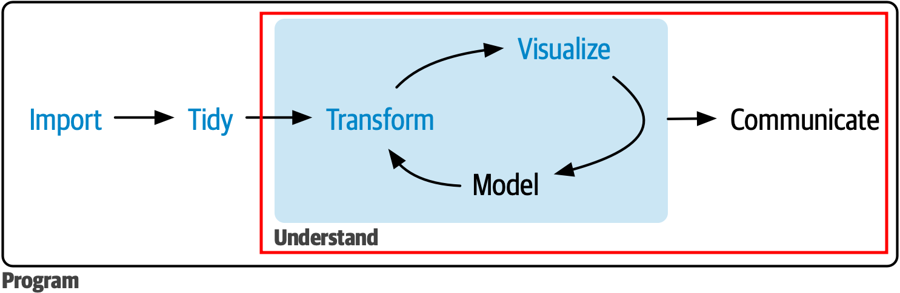

layout: true

background-image: url(figures/template_middlepage.png)
background-size: cover

```{r libririesandcustoms, include=FALSE, warning=FALSE}
  library(xaringanthemer)
  library(icons)
  colors = c(
    red = "#f34213",
    purple = "#3e2f5b",
    orange = "#ff8811",
    green = "#136f63",
    white = "#FFFFFF",
    midnightblue = "#191970"
  )
```

---
exclude: TRUE
class: center, top

<br/><br/><br/><br/><br/><br/><br/>

.orange[<b>Telmo dos Santos Klipp</b>]

.small[
Graduação em Tecnologias da Informação e Comunicação (UFSC, 2009-2013) <br/>
Mestrado em Engenharia de Computação (FURG, 2013-2015) <br/>
Bolsista CNPq no Laboratório de Computação para Clima Espacial (LCCE/INPE, 2015-2020) <br/>
Doutorando em Computação Aplicada (INPE, 2020-atual) <br/>
]

---
### .orange[`r icons::fontawesome("info-circle")` Informações Gerais sobre o Curso]

- <p class="jst">Materiais disponibilizados via <A href="https://classroom.google.com/u/0/c/NjExMjg5MTU0OTY3">Classroom</A>;</p> 
- <p class="jst">O aprendizado requer a prática que será constante nas aulas;</p>
- <p class="jst">Será cobrado ao menos uma atividade semanal `r icon_style(fontawesome("thumbtack"), fill = "black")`.</p> 

.pull-left[
Bibliografia Básica:

 .tiny[- <p class="jst">Kennedy, R., & Waggoner, P. D. (2021). Introduction to r for social scientists: a tidy programming approach. CRC Press.</p>

```{r out.width = '48%', echo=FALSE, fig.align = "center"}
knitr::include_graphics("figures/basicblibliograph.png") 
```
]
]

.pull-right[
Bibliografia Complementar:

 .tiny[- <p class="jst">Wickham, H., Çetinkaya-Rundel, M., & Grolemund, G. (2023). R for data science (2e): import, tidy, transform, visualize, and model data. "O'Reilly Media, Inc.". Disponível em: <A href="https://r4ds.hadley.nz/">https://r4ds.hadley.nz/</A>. Acesso em: 14 de junho, 2023. (Online) </p>
- <p class="jst">Damiani, A. et. al., (2022). Ciência de Dados em R. Curso-R. Disponível em: <A href="https://livro.curso-r.com">https://livro.curso-r.com</A>. Acesso em: 12 de maio, 2023. (Online)</p>
-  <p class="jst">de Aquino, J. A. (2014). R para cientistas sociais. Editora da UESC (editus). Disponível em: <A href="http://www.uesc.br/editora/index.php?item=conteudo_livros_digitais.php">http://www.uesc.br/editora/</A>. Acesso em: 12 de maio, 2023. </p>
-  <p class="jst">de Oliveira, P. F., Guerra, S., McDonnell, R. (2018). Ciência de Dados com R: Introdução. Editora IBPAD. Disponível em: <A href="https://cdr.ibpad.com.br/index.html">https://cdr.ibpad.com.br/index.html</A>. Acesso em: 12 de maio, 2023. (Online) </p> ] 
]

---

### .orange[Nas últimas aulas vimos:]
- Representação de dados no R (objetos).

- Persistência de dados na memória.

- Como declarar funções no R.

- Como e porque inserir comentários.

---

## .orange[Fundamentos do R - `r icons::fontawesome("r-project")` session]

<p class="jst"><b>Literalmente o ambiente de execução do R</b>. Todos os objetos que criamos, bibliotecas que importamos, comandos que usamos acontecem no contexto de uma .purple[<i>R session</i>]. O RStudio, por sua vez, inicia uma .purple[<i>R session</i>] ao ser executado e passa a interagir com a mesma. Podemos salvar objetos e o histórico de comandos da sessão R em arquivos, conforme: </p> 
  ```{r, eval=FALSE}
  save.image(file = ".RData")     # salva todos os objetos
  load(file = ".RData")           # carrega todos os objetos
  savehistory(file = ".Rhistory") # salva o histórico de comandos
  loadhistory(file = ".Rhistory") # carrega o histórico de comandos
  ```
<b>Como configurar para salvar esses arquivos no RStudio?</b> 
<p class="jst"> No menu principal: <i>Tools</i> `->` <i>Global Options</i> (menu <i>General</i>, aba <i>Basic</i>).</p>

--

</br>

> .center[<b>Isso nos mantém organizados e seguros sobre nossos dados e atividades no R?</b>]

---
## .orange[Fundamentos do R - `r icons::simple_icons("diagramsdotnet")` projeto]

<p class="jst">Projetos permitem organização, seja em algum trabalho, seja na vida no geral.  No R isso não é diferente. <b>O que pretendemos organizar?</b></p>

- Diferentes tipos de arquivos (ex: .R, .csv, .png ...).

- Diferentes tipos de dados, salvos em arquivos.

- Arquivos especiais do R (ex: `.RData` e `.RHistory` ...).

- Outros arquivos com informações relativas  ao projeto.

--

<b>Ganhos?</b>

- Gestão e controle das etapas do projeto.
- Gestão e controle dos recursos do projeto (ex: dados, <i>R scripts</i>). 
- Produtividade e gerenciamento de tempo.

---
## .orange[Fundamentos do R - `r icons::simple_icons("diagramsdotnet")` projeto]

```{r out.width = '100%', echo=FALSE, fig.align = "center"}
knitr::include_graphics("figures/rstudio_project_files.png") 
```

.left[.footnote[.small[Créditos: <A href="https://datacarpentry.org/r-socialsci/00-intro.html"> Erin Becker (2023)</A>.]] ]

---
## .orange[Fundamentos do R - `r icons::simple_icons("diagramsdotnet")` projeto]

<b>Por onde começar?</b>

- Escolher um diretório de trabalho/pasta para o projeto. 

--

<p class="jst"><b>Diretórios?</b> Subdivisões de um sistema de arquivos que permitem organização hierárquica. Diretórios podem ter:</p>

- Caminhos absolutos
  - C:/Users/username/meus_programas/... ; D:/meus_dados/ ... (Windows)
  - /home/usuario/meus_dados/ ... (linux)
  
- Caminhos relativos 
  - ~/projeto1
  - ~/projeto2 </br> . </br> . </br> .
  - ~/projetoN
  
---

## .orange[Fundamentos do R - `r icons::simple_icons("diagramsdotnet")` projeto]

<p class="jst">O RStudio permite a configuração de um diretório de trabalho padrão.</p>

```{r out.width = '58%', echo=FALSE, fig.align = "center"}
 
```

---

## .orange[Fundamentos do R - `r icons::simple_icons("diagramsdotnet")` projeto]

<p class="jst">Criar um projeto no R é uma boa prática. Para isso é importante entender sobre manipulação e definição do diretório de trabalho. Considere as funções:  </p>
  ```{r, eval=FALSE}
  getwd()      # Retorna (imprime) o diretório de trabalho atual
  setwd()      # Muda o diretório atual para o indicado no argumento
  dir.create() # Cria um diretório ou apenas uma pasta
  list.files() # Lista as pastas e arquivos contidas no diretório de
               # trabalho atual
  setwd(choose.dir()) # Escolha por interface gráfica
  setwd("meu_diretorio/pasta_do_meu_projeto") # Um exemplo de uso
  ```
> <p class="center">Obs:  .purple[<b>setwd("../")</b>] dir. anterior  `\leftarrow` `->` .purple[<b>setwd("./")</b>] dir. atual</p>

<p class="jst">Na aba principal do RStudio: Session `->` Set Working Directory `->` Choose Directory (ou Ctrl + Shift + H).</p>

--

> .center[<b>Mãos a obra! Escolha um diretório onde ficaram seus .purple[`R Project`].</b>]

---

## .orange[Fundamentos do R - `r icons::simple_icons("diagramsdotnet")` projeto]

<p class="jst">No menu principal do RStudio: File `->` New Project `->` New Directory `->` New Project. </p>

```{r out.width = '70%', echo=FALSE, fig.align = "center"}
 
```

---

## .orange[Fundamentos do R - `r icons::simple_icons("diagramsdotnet")` projeto]

<p class="jst">No menu secundário do RStudio, canto superior direito e acima do painel contendo a aba Ambiente, há um menu para projetos.</p>

.pull-left[
```{r out.width = '100%', echo=FALSE, fig.align = "center"}
 
```
]
.pull-right[
```{r out.width = '100%', echo=FALSE, fig.align = "center"}
 
```
]
---

## .orange[Fundamentos do R - `r icons::simple_icons("diagramsdotnet")` projeto]

O arquivo principal do .purple[`R Project`] tem como extensão .purple[`.Rproj`].

```{r out.width = '80%', echo=FALSE, fig.align = "center"}
 
```

--

</br>
.center.large[<b>Certo! E agora?</b> `r  icons::icon_style(icons::simple_icons("odysee"), scale = 2)`] 


---
## .orange[Fundamentos do R - `r icons::fontawesome("box-open")` pacotes]


 <p class="jst"> <b>Essenciais no R, pacotes podem conter conjunto de outros pacotes, biblioteca de funções e estruturas de dados.</b> Pacotes permitem customização (ao gosto de cada um), assim como instalar apenas o que é necessário. Pacotes são formas de distribuir soluções (funcionalidades) que outras pessoas produziram.</p>

- <p class="jst">Existem inúmeros pacotes no repositório official <A href="https://cran.r-project.org/">CRAN</A>.</p>

- <p class="jst">Existem inúmeros pacotes em repositórios não oficiais (ex: Github).</p>

--

</br>

<p class="jst"> <b>Por onde começar?</b> Instalar um pacote desejado segundo alguma opção. É comum proceder por linha de comando (no console ou terminal) usando a função .purple[`install.packages()`], conforme:</p>
  ```{r, eval=FALSE}
  install.packages("tidyverse")
  ```

---
## .orange[Fundamentos do R - `r icons::fontawesome("box-open")` pacotes]

<p class="jst"><b>Por onde começar?</b> Na aba Pacotes (<i>Packages</i>) do RStudio (ao lado da aba Ajuda) clicar em  `Install` e depois procurar/digitar o nome do pacote desejado. </p>

.pull-left[
```{r out.width = '100%', echo=FALSE, fig.align = "center"}
 
```
]
.pull-right[
```{r out.width = '100%', echo=FALSE, fig.align = "center"}
 
```
]

--

</br>

> .center[<b>Ao longo do curso, trabalharemos com alguns pacotes, mas vamos instalá-los conforme forem necessários.</b>]

---
## .orange[Fundamentos do R - `r icons::fontawesome("box-open")` pacotes]

<p class="jst">Após a instalação do pacote é possível carregá-lo na sessão do R atual, conforme:</p>
  ```{r, eval=FALSE}
  library(tidyverse)            # carrega o pacote
  require(tidyverse)            # também carrega o pacote
  library(help = tidyverse)     # documentação do pacote
  detach("package:tidyverse")   # retira o pacote da sessão atual
  ```
  
--

<p class="jst">Isso fará com que o conjunto de funções e dados (ou até mesmo outros pacotes) instalados fique disponível para uso.</p>

<p class="jst">Em toda nova sessão do R, será necessário carregar o pacote. </p> 

<p class="jst">A instalação do pacote é realizada apenas uma vez, embora possa ser necessário atualizações eventuais.</p>

---
## .orange[Fundamentos do R - `r icons::fontawesome("box-open")` pacotes]

<p class="jst">Os objetos contidos nos pacotes (ex: funções e estruturas de dados) podem ser acessados usando o operador <i>Double Colon</i> (.purple.large[`::`]), conforme:</p>
  ```{r, eval=FALSE}
  tidyverse::tidyverse_packages()
  ```

--

O uso de .purple.large[`::`] representa uma boa prática. <b>Motivo?</b>
  - Mascaramento de funções; 
      ```{r, eval=FALSE}
      tidyverse::tidyverse_conflicts()
      ```
  
  - Clareza de código;
  
  - Reprodutibilidade;

---
## .orange[Fundamentos do R - `r icons::fontawesome("box-open")` pacotes]


<p class="jst"> O RStudio tem várias funcionalidades interessantes. Por exemplo, é possível rodar os exemplos do uso de uma função, disponíveis na aba Ajuda. No entanto, essa funcionalidade requer o pacote .purple[<b>`knitr`</b>]. </p>

<p class="jst">Faça uma consulta usando <i>help</i> ao pacote .purple[<b>`datasets`</b>], na forma:</p>
  ```{r, eval=FALSE}
  help(package = "datasets")
  ```

<p class="jst"> Procure e clique no conjunto de dados .purple[<b>`sunspots`</b>]  e rode o exemplo apresentado clicando no <i>link .blue[Run examples]</i>. </p>

--

<p class="jst">Muito provavelmente você não terá o pacote  .purple[<b>`knitr`</b>] instalado. Portanto, instale esse pacote e depois tente rodar o exemplo novamente.</p>

--

<br/>

> .center.large[<b>Você acaba de instalar um pacote versátil que pode ser muito útil para usuários de R.</b>]

---
## .orange[Fundamentos do R - `r icons::fontawesome("box-open")` pacotes]

<p class="jst">Pacotes tem ampla documentação, sendo um dos requerimentos aos desenvolvedores para tornar um pacote disponível no repositório oficial. Alguns exemplos: </p>

- <p class="jst">Manual do pacote no <A href="https://cran.r-project.org/">CRAN</A>.</p>

- <p class="jst"><i>Vignettes</i> - são documentos <i>html</i> mostrando usos específicos de um pacote e suas funções, muitas vezes direcionado a solução de um problema.</p>
  ```{r, eval=FALSE}
   browseVignettes()
  ```
- <p class="jst"> <i>Cheatsheets</i> - são doumentos com notas curtas e exemplos de uso para consultas rápidas. Ex: <A href="https://www.rstudio.com/wp-content/uploads/2015/02/data-wrangling-cheatsheet.pdf"><i>Data Wrangling Cheatsheet</i></A>.</p>

---
## Questões e Prática

- <p class="jst">Quais pacotes compõem o tidyverse?</p>

- <p class="jst">O tidyverse possui uma lista de pacotes, porém somente alguns (<i>core packages</i>) são carregados automaticamente. Experimente carregar o pacote .purple[<b>readxl</b>]. O que este pacote faz? </p>

- <p class="jst">Após carregar o tidyverse, desejamos produzir gráficos com .purple[`ggplot()`]. Para isso, devemos carregar o pacote .purple[<b>ggplot2</b>] com .purple[`library()`]?</p>

- <p class="jst">Instale o pacote .purple[<b>patchwork</b>].</p>

- <p class="jst">Instale o pacote .purple[<b>basedosdados</b>].</p>

---
### .orange[Fundamentos do R - `r icons::fontawesome("database")` salvar/carregar]

<p class="jst">Existem diversas maneiras para salvar/carregar dados, sendo comum proceder por linha de comando. São exemplos de funções do pacote .purple[<b>base</b>]:</p>
  ```{r, eval=FALSE}
  saveRDS(object = obj, file = "my_object.rds")  # salva um objeto
  readRDS(file = "my_object.rds")                # carrega um objeto
  save.image(file = ".RData")                    # salva objetos
  load(file = ".RData")                          # carrega objetos
  writeLines(text = "Abacate!", con = "file.txt")# salva texto
  readLines(con = "file.txt")  # lê o texto do arquivo linha a linha
  ```
--

</br>

> <p class="jst"> <b> Vá em frente e descubra opções no console: </b> </p>
> - .purple[base::rea] ... 
> - .purple[base::write] ...

---
### .orange[Fundamentos do R - `r icons::fontawesome("table")` salvar/carregar]

<p class="jst">Para formatos do tipo tabular/retangular, o pacote .purple[<b>utils</b>] possui uma família de funções do tipo .purple[`write.tipo-do-arquivo()`] e .purple[`read.tipo-do-arquivo()`].</p>
  ```{r, eval=FALSE}
  write.table; read.table()   # salva/lê arquivos do tipo tabular
  write.csv(); read.csv()     # salva/lê arquivos do tipo CSV
  write.csv2; read.csv2()     # salva/lê arquivos do tipo CSV
  ```
--

> <p class="jst"><b>Comma-separated values (CSV)</b>: Arquivo do tipo texto simples (<i>plain text</i>) cujos valores são separados por vírgula. Cada linha é um registro e cada coluna é um campo, portanto, os dados terão formato tabular. É comum usar outros separadores para delimitação de campos como ponto e vírgula, espaço e tab. </p>

--

</br>

<p class="jst"> .purple[`read.table()`] considera espaçamentos regulares (espaço, tab) como separador, enquanto .purple[`read.csv()`] a vírgula (.purple.large[<b>,</b>]) e .purple[`read.csv2()`] o ponto e vírgula (.purple.large[<b>;</b>]). No entanto, essas funções possuem o parâmetro .purple[sep], sendo possível informar qual o separador do arquivo. </p>

---
### .orange[Fundamentos do R - `r icons::fontawesome("table")` salvar/carregar]

<p class="jst">Para formatos do tipo tabular/retangular, o pacote .purple[<b>readr</b>] tem uma família de funções do tipo .purple[`write_tipo-do-arquivo()`] e .purple[`read_tipo-do-arquivo()`].</p>
  ```{r, eval=FALSE}
  write_delim(); read_delim() # salva/lê arquivos do tipo tabular
  write_tsv(); read_tsv()     # salva/lê arquivos com espaçamento
  write_csv(); read_csv()     # salva/lê arquivos do tipo CSV
  write_csv2(); read_csv2()   # salva/lê arquivos do tipo CSV
  ```
--

</br>

<p class="jst"> Somente .purple[`read_delim()`] possui um parâmetro (.purple[delim]) que permite informar qual o separador do arquivo.</p>

--

</br>

.center.large[<b>Bom! Agora, enfim, começa a parte divertida!</b> `r  icons::icon_style(icons::simple_icons("odysee"), scale = 2)`]

---
## Questões e Prática

<p class="jst">As funções .purple[`dir.create()`] e .purple[`download.file()`] permitem criar diretórios/pastas e baixar arquivos da internet, respectivamente. </p>

- <p class="jst"> Crie uma pasta de dados no seu .purple[R project] e faça o <i>download</i> de dois arquivos contendo séries  históricas de desocupação (Fonte: PNAD contínua), conforme:</p> 
  ```{r, eval=FALSE}
  dir.create("dados")
  download.file(url = "link 1", destfile = "dados/file-name.csv")
  # Use mode = "wd" para baixar o arquivo excel no Windows
  download.file(url = "link 2",
                destfile = "dados/file-name.xlsx", mode = "wd")
  ```

Links:

> https://tsklipp.github.io/metodologias-informacionais-com-r/slides/files/taxa_desocupacao_sexo_2012-2013.csv
> https://tsklipp.github.io/metodologias-informacionais-com-r/slides/files/taxa_desocupacao_idade_2012-2013.xlsx

---
## Questões e Prática

- <p class="jst">Leia o arquivo .purple[.csv] salvo usando as funções .purple[`utils::read.csv2()`] e .purple[`readr::read_csv2()`] armazenando os dados em dois objetos diferentes - considere usar o parâmetro .purple[skip = 1]. Os objetos criados são da mesma classe (tipos iguais)? </p>

- <p class="jst">Leia o arquivo .purple[.xlsx] salvo usando a função .purple[`readxl::read_excel()`] e armaze os dados em um objeto. Qual o tipo desse novo objeto? </p>

- <p class="jst">Considerando a estruturação dos dados atual, é possível executar diferentes operações sobre os dados e tarefas de análise com facilidade?</p>

---
class: center, middle

```{r message=FALSE, warning=FALSE, echo=FALSE}
dt <- readxl::read_excel("files/taxa_desocupacao_idade_2012-2013.xlsx")
library(kableExtra)
dt %>%
    kable(caption = 'Taxa de Desocupação') %>%
    kable_styling(bootstrap_options = c('striped', 'condensed')) %>%
    scroll_box(width = "760px", height = "560px")
```

---
class: center, middle

```{r message=FALSE, warning=FALSE, echo=FALSE}
dt <- readr::read_delim("files/taxa_desocupacao_sexo_2012-2013.csv", delim = ";",skip = 1)
library(kableExtra)
dt %>%
    kable(caption = 'Taxa de Desocupação') %>%
    kable_styling(bootstrap_options = c('striped', 'condensed')) %>%
    scroll_box(width = "760px", height = "560px")
```

---
### .orange[Fundamentos do R - `r icons::fontawesome("table")` tidy data]

- Cada coluna é um atributo (variável)
- Cada linha é uma observação (instância)
- Cada célula possui um único valor

.right[.small[Créditos:  <A href="https://r4ds.hadley.nz/data-tidy.html"> Wickham, et al (2023)</A>.]]
```{r out.width = '100%', echo=FALSE, fig.align = "center"}
knitr::include_graphics("figures/tidy-1.png") 
```

> <p class="jst">`"Conjunto de dados organizados (tidy) são todos iguais, mas todo conjunto bagunçado é bagunçado à sua maneira."`</p>
> — Hadley Wickham 

---
### .orange[Ciclo da ciência dos dados - "whole game"]

```{r out.width = '100%', echo=FALSE, fig.align = "center"}

 
```

.left[.footnote[.small[Créditos: Adaptado de  <A href="https://r4ds.hadley.nz/whole-game.html"> Wickham, et al (2023)</A>.]] ]

---
class: left, top

### .orange[Referências]

```{r, load_refs, echo=FALSE}
library(RefManageR)
bib <- ReadBib("./files/02-mybib.bib", check = FALSE)
generateReferences <- function(bib) {
  for(i in 1:length(bib)) {
    print(bib[i], .opts = list(check.entries = FALSE, style = "html", bib.style = "authoryear"))
  }
}
```

```{r, print_refs, results='asis', echo=FALSE, warning=FALSE, message=FALSE}
writeLines('.small[')
generateReferences(bib)
writeLines(']')
```

---
class: center, middle

background-image: url(figures/template_endpage.png)
background-size: contain

.center[.large[<b> Metotologias Informacionais com `r icon_style( icons::simple_icons("r"), scale = 2)`</b> ]]

.xxlarge[<b style="color:MidnightBlue "> Muito Obrigado pela Atenção!</b>]
  
