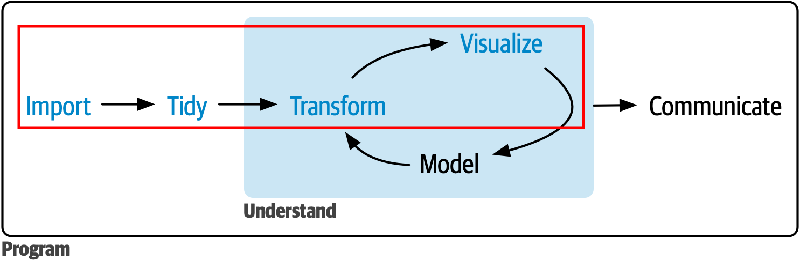
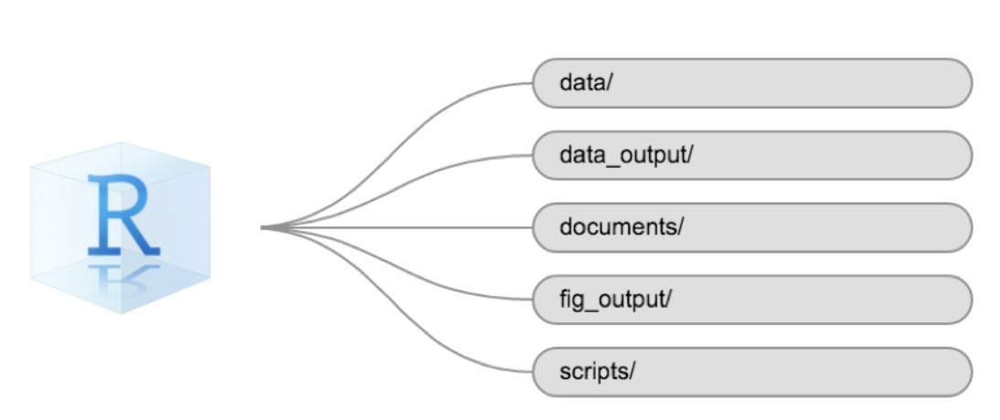

layout: true

background-image: url(figures/template_middlepage.png)
background-size: cover

```{r libririesandcustoms, include=FALSE, warning=FALSE}
  library(xaringanthemer)
  library(icons)
  colors = c(
    red = "#f34213",
    purple = "#3e2f5b",
    orange = "#ff8811",
    green = "#136f63",
    white = "#FFFFFF",
    midnightblue = "#191970"
  )
```

---
exclude: TRUE
class: center, top

<br/><br/><br/><br/><br/><br/><br/>

.orange[<b>Telmo dos Santos Klipp</b>]

.small[
Graduação em Tecnologias da Informação e Comunicação (UFSC, 2009-2013) <br/>
Mestrado em Engenharia de Computação (FURG, 2013-2015) <br/>
Bolsista CNPq no Laboratório de Computação para Clima Espacial (LCCE/INPE, 2015-2020) <br/>
Doutorando em Computação Aplicada (INPE, 2020-atual) <br/>
]

---
### .orange[`r icons::fontawesome("info-circle")` Informações Gerais sobre o Curso]

- <p class="jst">Materiais disponibilizados via <A href="https://classroom.google.com/u/0/c/NjExMjg5MTU0OTY3">Classroom</A>;</p> 
- <p class="jst">O aprendizado requer a prática que será constante nas aulas;</p>
- <p class="jst">Será cobrado ao menos uma atividade semanal `r icon_style(fontawesome("thumbtack"), fill = "black")`.</p> 

.pull-left[
Bibliografia Básica:

 .tiny[- <p class="jst">Kennedy, R., & Waggoner, P. D. (2021). Introduction to r for social scientists: a tidy programming approach. CRC Press.</p>

```{r out.width = '48%', echo=FALSE, fig.align = "center"}
knitr::include_graphics("figures/basicblibliograph.png") 
```
]
]

.pull-right[
Bibliografia Complementar:

 .tiny[- <p class="jst">Wickham, H., Çetinkaya-Rundel, M., & Grolemund, G. (2023). R for data science (2e): import, tidy, transform, visualize, and model data. "O'Reilly Media, Inc.". Disponível em: <A href="https://r4ds.hadley.nz/">https://r4ds.hadley.nz/</A>. Acesso em: 14 de junho, 2023. (Online) </p>
- <p class="jst">Damiani, A. et. al., (2022). Ciência de Dados em R. Curso-R. Disponível em: <A href="https://livro.curso-r.com">https://livro.curso-r.com</A>. Acesso em: 12 de maio, 2023. (Online)</p>
-  <p class="jst">de Aquino, J. A. (2014). R para cientistas sociais. Editora da UESC (editus). Disponível em: <A href="http://www.uesc.br/editora/index.php?item=conteudo_livros_digitais.php">http://www.uesc.br/editora/</A>. Acesso em: 12 de maio, 2023. </p>
-  <p class="jst">de Oliveira, P. F., Guerra, S., McDonnell, R. (2018). Ciência de Dados com R: Introdução. Editora IBPAD. Disponível em: <A href="https://cdr.ibpad.com.br/index.html">https://cdr.ibpad.com.br/index.html</A>. Acesso em: 12 de maio, 2023. (Online) </p> ] 
]

---

### .orange[Nas últimas aulas vimos:]
- Definição de uma sessão do R.

- Como nos manter organizados usando .purple[R project].

- Diretórios (caminhos absolutos e relativos), pastas e tipos de arquivos.

- Pacotes no R.

- Salvar e carregar dados.

- Conceitos iniciais de dados brutos e  tratados (arrumados/organizados).

- Onde ficaremos no ciclo da ciência dos dados?

---
### .orange[Ciclo da ciência dos dados - "whole game"]

.right[.small[Créditos: Adaptado de <A href="https://r4ds.hadley.nz/data-tidy.html"> Wickham, et al (2023)</A>.]]
```{r out.width = '100%', echo=FALSE, fig.align = "center"}
 
```

</br>
>.center[<b>Vamos fazer gestão e manipulação de dados considerando .purple[R project] e <i>Data Wrangling</i></b>.]

---

### .orange[Fundamentos do R - `r icons::simple_icons("diagramsdotnet")` projeto]

<p class="jst">Projetos permitem organização, seja em algum trabalho, seja na vida no geral.  No R isso não é diferente. <b>O que pretendemos organizar?</b></p>

- Diferentes tipos de arquivos (ex: .R, .csv, .png ...).

- Diferentes tipos de dados, salvos em arquivos.

- Arquivos especiais do R (ex: `.RData` e `.RHistory` ...).

- Outros arquivos com informações relativas  ao projeto.

--

<b>Ganhos?</b>

- Gestão e controle das etapas do projeto.
- Gestão e controle dos recursos do projeto (ex: dados, <i>R scripts</i>). 
- Produtividade e gerenciamento de tempo.

---
### .orange[Fundamentos do R - `r icons::simple_icons("diagramsdotnet")` projeto]

```{r out.width = '100%', echo=FALSE, fig.align = "center"}
 
```

.left[.footnote[.small[Créditos: <A href="https://datacarpentry.org/r-socialsci/00-intro.html"> Erin Becker (2023)</A>.]] ]

---
background-image: url(figures/tidyverse2.png)
background-size: contain

### .orange[Tidyverse]

<p class="jst"><b>Coleção de pacotes que possuem filosofia de design, gramática e estrutura de dados em comum e, permitem trabalho conjunto, clareza de código, reprodutibilidade, dentre outros benefícios.</p> 

---
### .orange[Gestão e Manipulação de `r icons::fontawesome("table")` dados]

<p class="jst">Crie um .purple[R project]. Vamos trabalhar com dados da PNAD contínua do IBGE relativos à população brasileira. Para isso precisaremos: </p>

</br>

- Criar uma pasta para dados e outra para <i>scripts</i> na pasta principal (raiz) do .purple[R project].

- Baixar os dados (use a tecla .purple[P] para obter informações).

- <p class="jst">Obs: Parte dos dados que serão usados foram baixados por meio do pacote <A href="https://basedosdados.org/dataset/9fa532fb-5681-4903-b99d-01dc45fd527a?table=9e4ab8f4-3ad4-47fb-9919-5658d2e09c4f">basedosdados</A>. Existem outras alternativas de dados disponíveis nessa base, sendo necessário seguir alguns passos para o uso do pacote conforme o <A href="https://dev.to/basedosdados/como-usar-a-biblioteca-basedosdados-no-r-capitulo-1-46kb">tutorial de uso</A> e  <A href="https://basedosdados.github.io/mais/api_reference_r/">documentação específica</A>.</p>


???
Criar uma pasta:
- .purple[`dir.create()`], ou
- usar a interface gráfica do RStudio

Para download dos arquivos, proceda os passos da <A href="https://basedosdados.org/dataset/9fa532fb-5681-4903-b99d-01dc45fd527a?table=9e4ab8f4-3ad4-47fb-9919-5658d2e09c4f">basedosdados</A>, ou apenas faça o download diretamente clicando nos links:

- https://tsklipp.github.io/metodologias-informacionais-com-r/dados/populacao_brasil_pnadc.csv
- https://tsklipp.github.io/metodologias-informacionais-com-r/dados/populacao_brasil_pnadc_cor.csv

Baixe também dados que foram obtidos no <A href="https://www.ibge.gov.br/estatisticas/sociais/trabalho/17270-pnad-continua.html?=&t=series-historicas">site</A> do IBGE: 

- https://tsklipp.github.io/metodologias-informacionais-com-r/dados/taxa_desocupacao_idade_2012-2013.xlsx

---
### .orange[Gestão e Manipulação de `r icons::fontawesome("table")` dados]

- Leia os dados da população brasileira.

- Os dados estão no formato .purple[tidy]? Em caso negativo arrume-os.
.right[.small[Créditos:  <A href="https://r4ds.hadley.nz/data-tidy.html"> Wickham, et al (2023)</A>.]]
```{r out.width = '100%', echo=FALSE, fig.align = "center"}
knitr::include_graphics("figures/tidy-1.png") 
```
> <p class="jst">`"Conjunto de dados organizados (tidy) são todos iguais, mas todo conjunto bagunçado é bagunçado à sua maneira."`</p>
> — Hadley Wickham 

- Salve em novos arquivos.

???

Vamos usar:
- .purple[`readr::read_csv()`] e .purple[`readxl::read_excel()`]
- o operador pipe .purple[|>] 
- .purple[`dplyr::filter()`], .purple[`dplyr::select()`], .purple[`dplyr::mutate()`] e .purple[`dplyr::summarise()`]
- .purple[`tidyr::drop_na()`] e .purple[`tidyr::pivot_longer()`]
- .purple[`stringr::str_replace()`]
- .purple[`readr::write_csv()`]

Salvar as operações em .purple[R scripts]

---
### .orange[Gestão e Manipulação de `r icons::fontawesome("database")` dados]

Vamos vislumbrar:

- Como fazer um plot básico com .purple[<b>ggplot2</b>]

- Como personalizar o plot.

- O uso do operador .purple[pipe]

- Como produzir um plot interativo com .purple[<b>plotly</b>]

Salvaremos os passos em um .purple[R script].

Salvaremos as figuras produzidas em uma nova pasta.

---
class: left, top

### .orange[Referências]

```{r, load_refs, echo=FALSE}
library(RefManageR)
bib <- ReadBib("./files/02-mybib.bib", check = FALSE)
generateReferences <- function(bib) {
  for(i in 1:length(bib)) {
    print(bib[i], .opts = list(check.entries = FALSE, style = "html", bib.style = "authoryear"))
  }
}
```

```{r, print_refs, results='asis', echo=FALSE, warning=FALSE, message=FALSE}
writeLines('.small[')
generateReferences(bib)
writeLines(']')
```

---
class: center, middle

background-image: url(figures/template_endpage.png)
background-size: contain

.center[.large[<b> Metotologias Informacionais com `r icon_style( icons::simple_icons("r"), scale = 2)`</b> ]]

.xxlarge[<b style="color:MidnightBlue "> Muito Obrigado pela Atenção!</b>]
  
