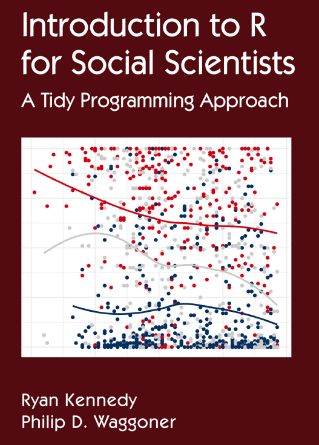

layout: true

background-image: url(figures/template_middlepage_2.png)
background-size: cover

```{r libririesandcustoms, include=FALSE, warning=FALSE}
  library(xaringanthemer)
  library(icons)
  colors = c(
    red = "#f34213",
    purple = "#3e2f5b",
    orange = "#ff8811",
    green = "#136f63",
    white = "#FFFFFF",
    midnightblue = "#191970"
  )
```

---
### .orange[`r icons::fontawesome("info-circle")` Informações Gerais sobre o Curso]

- <p class="jst">Materiais disponibilizados via <A href="https://classroom.google.com/u/0/c/NjExMjg5MTU0OTY3">Classroom</A>;</p> 
- <p class="jst">O aprendizado requer a prática que será constante nas aulas;</p>

.pull-left[
Bibliografia Básica:

 .tiny2[- <p class="jst">Kennedy, R., & Waggoner, P. D. (2021). Introduction to r for social scientists: a tidy programming approach. CRC Press.</p>

```{r out.width = '39%', echo=FALSE, fig.align = "center"}
 
```
]
]

.pull-right[
Bibliografia Complementar:

 .tiny2[- <p class="jst">Wickham, H., Çetinkaya-Rundel, M., & Grolemund, G. (2023). R for data science (2e): import, tidy, transform, visualize, and model data. "O'Reilly Media, Inc.". Disponível em: <A href="https://r4ds.hadley.nz/">https://r4ds.hadley.nz/</A>. Acesso em: 14 de junho, 2023. (Online) </p>
- <p class="jst">Damiani, A. et. al., (2022). Ciência de Dados em R. Curso-R. Disponível em: <A href="https://livro.curso-r.com">https://livro.curso-r.com</A>. Acesso em: 12 de maio, 2023. (Online)</p>
-  <p class="jst">de Aquino, J. A. (2014). R para cientistas sociais. Editora da UESC (editus). Disponível em: <A href="http://www.uesc.br/editora/index.php?item=conteudo_livros_digitais.php">http://www.uesc.br/editora/</A>. Acesso em: 12 de maio, 2023. </p>
-  <p class="jst">de Oliveira, P. F., Guerra, S., McDonnell, R. (2018). Ciência de Dados com R: Introdução. Editora IBPAD. Disponível em: <A href="https://cdr.ibpad.com.br/index.html">https://cdr.ibpad.com.br/index.html</A>. Acesso em: 12 de maio, 2023. (Online) </p> ] 
]

---

### .orange[Nas últimas aulas vimos:]

- Visualização de dados de forma estática com .purple[<b>ggplot2</b>]

- Visualização de dados de forma interativa com .purple[<b>plotly</b>]

</br></br></br>

> .center[<b>Agora agregaremos algumas habilidades de programação.</b>]

---
### .orange[Conceitos de Programação]

Habilidades de programação englobam aspectos como:

- Raciocínio lógico.

- Entendimento de problemas.

- Compreensão de métodos para a solução de problemas:
  - Solução algorítmica (sequência de passos);
  - Dividir para conquistar.
  
- Conhecimentos técnicos:
  - dos recursos computacionais;
  - de recursos da linguagem de programação em uso;
  - de estruturas de dados;
  - de formatos de dados e arquivos.

---
### .orange[Conceitos de Programação]

<p class="jst"> Linguagens de programação surgiram e evoluíram considerando a criação de recursos para:</p>

- <p class="jst">A solução de problemas com instruções de máquina (ex: acessar posições de memória, mover dados, executar operações matemáticas), lógica condicional, laços de repetição, entre outros.</p>
- <p class="jst">Representação, armazenamento e manipulação de dados: tipos básicos (ex: inteiro e carácter) e estruturas de dados (ex: vetores, matrizes e listas), leitura e escrita de arquivos, entre outros.</p>
- <p class="jst">Criação de recursos para reaproveitamento e organização de código como a modularização (ex: funções, classes e objetos).</p>
- <p class="jst">Elevar a abstração para flexibilizar e expandir as representações computacionais e facilitar o entendimento humano, exemplos:</p>
    - Linguagens de programação de baixo nível (linguagem de máquina e de montagem) para de alto nível (C, C++, Java, Python, R);
    - Conceitos de programação como orientação a objetos, programação funcional e programação literal (ex: <i>grammar of graphics</i>).

>  .center[<b>O R é uma linguagem de alto nível que engloba vários dos pontos mencionados.</b>]

---
### .orange[Conceitos de Programação no R  - objetos básicos]

- <p class="jst">Já vimos que existem 6 tipos básicos (atômicos) de objetos:</p>
  - .content-box-yellow[numeric;]
  - .content-box-yellow[integer;]
  - .content-box-yellow[character;]
  - .content-box-yellow[logical;]
  - complex;
  - raw.

</br>
> .center[<b>Objetos tem classes, bem como, podem ter atributos (metadados), que determinam os tipos de manipulações e operações aplicáveis  nestes individualmente e entre si.</b>]

---
### .orange[Conceitos de Programação no R - objetos básicos]

<p class="jst">Outra característica do R é ser uma linguagem vetorial. Os objetos básicos vistos anteriormente são vetores, podendo armazenar um ou mais elementos, desde que do mesmo tipo. Observe:</p>

```{r}
  vetor_de_numeros <- 7
  vetor_de_numeros[1]
  vetor_de_numeros[2:6] <- c(1, 2, 3, 4, 99)
  vetor_de_numeros[6]
```

```{r}
  length(vetor_de_numeros)
  typeof(vetor_de_numeros)
```

---
### .orange[Conceitos de Programação no R - tipos de operadores]

Operadores são divididos basicamente em quatro categorias:

- Aritméticos: +, -, /, *, ^, %% e %/%.

- Relacionais: <, >, <=, >=, == e !=. 

- Lógicos: !, &, &&, | e ||. 

- De atribuição: <-, <<-, -> e ->>.

</br>

Vejamos detalhes neste material <A href="https://www.datamentor.io/r-programming/reserved-words"> online</A>.

---
### .orange[Conceitos de Programação no R - controle de fluxo]
 
<p class="jst"> Um importante fator em soluções algorítmicas é o controle de fluxo da sequência de operações. O R conta com as estruturas condicionais e de repetições comulmente conhecidas:</p>

- .blue[if(condicional) {intruções}] e .blue[if(condicional) {intruções}] ... .blue[else {intruções}] ou

- .blue[if(condicional1) {intruções} else if(condicional2) ] ... .blue[else {intruções}];

- .blue[ifelse(teste, verdadeiro, falso)]

- .blue[switch(teste, caso1, caso2, caso3....)];

- .blue[while(cond) {intruções}];

- .blue[for(variavel in sequencia) {intruções}];

- .blue[break] e .blue[next];

- .blue[repeat{intrucao1, intrucao2, intrucao3 ... break}];

</br>
Vejamos mais sobre estas estruturas nesse material <A href="https://www.datamentor.io/r-programming/reserved-words"> online</A>.

---
### .orange[Conceitos de Programação no R - objetos não básicos]

- <p class="jst">Vimos também alguns exemplos de objetos mais complexos:</p>
  - .content-box-yellow[factor;]
  - .content-box-yellow[data.frame;]
  - .content-box-yellow[function;]
  - .content-box-yellow[lists;]
  - matrices, arrays.

</br>

Vejamos detalhes no mesmo material <A href="https://www.datamentor.io/r-programming/reserved-words"> online</A>.

---
### .orange[Conceitos de Programação no R -funções]

<p class="jst"> Já vimos que funções realizam tarefas manipulando dados. Estas podem possuir mais de um parâmetro ou nenhum.  As funções retornam ao menos um novo objeto e um dos principais motivos para o uso é a modularização de código. Quebrar códigos em partes mais simples ajuda na manutenção e entendimento do mesmos.</p>

</br>

Vejamos igualmente detalhes no material <A href="https://www.datamentor.io/r-programming/reserved-words"> online</A>.

---
### .orange[Conceitos de Programação no R -funções]

<p class="jst">Elabore uma função que calcule a hipotenusa de um triângulo  retângulo conforme o Teorema de Pitágoras: .large[ $c^2$ = $a^2$ + $b^2$ ].</p>

--

</br>

Abaixo segue um protótipo com os argumentos necessários para a função:

```{r, eval=FALSE}
  calcula_hipotenusa <- function(a, b) {}
```

--

</br>

Uma possível solução:

```{r}
  calcula_hipotenusa <- function(a, b) {
    return(sqrt(a^2 + b^2))
  }
  calcula_hipotenusa(3, 4)
```

---
### .orange[Conceitos de Programação no R -funções]

Observe o seguinte exemplo de função:

```{r}
    calcula_hipotenusa <- function(a, b) {
      if(!is.numeric(a)) {
        stop('"a" must be numeric\n', 
             'You have provided an object of class: ', class(a))
      }
      sqrt(a^2 + b^2)
    }
```

--

```{r}
    calcula_hipotenusa <- function(a, b) {
      #if(!is.numeric(a)) {
      #  stop('"a" must be numeric\n', 
      #       'You have provided an object of class: ', class(a))
      #}
      sqrt(a^2 + b^2)
    }
    calcula_hipotenusa(3, 4)
```

---
### .orange[Conceitos de Programação no R -funções]

<p class="jst">Considerando o exemplo de função anterior. Que melhorias seriam possíveis para incrementar a proteção contra entradas erradas inseridas por usuários? Tente codificar essas melhorias. </p>


```{r, eval=FALSE}
    calcula_hipotenusa <- function(a, b) {
      if(!is.numeric(a) | !is.numeric(b)) {
          stop("\"a\" and \"b\" must be numeric!\n", 
               "You have provided object of classes \"a\": ", 
               class(a), " \"b\": ", class(b))
      }
      return(sqrt(a^2 + b^2))
   }
```

---
### .orange[Conceitos de Programação no R]

Pontos importantes para guardar:

- Abuse dos recursos da linguagem para modularização de código.
  - Crie suas próprias funções;
  - Crie seus próprios temas de gráficos do <b>ggplot2</b>, suas escalas, entre outros. Mantenha salvo em código para reuso.
  
- Se familiarize com o uso de funções. Muita problemas já foram resolvidos, bastando apenas conhecer os pacote e funções disponíveis. 

- Tente sempre automatizar tarefas.

---
exclude: TRUE
class: left, top

### .orange[Referências]

```{r, load_refs, echo=FALSE}
library(RefManageR)
bib <- ReadBib("./files/02-mybib.bib", check = FALSE)
generateReferences <- function(bib) {
  for(i in 1:length(bib)) { 
    print(bib[i], .opts = list(check.entries = FALSE, style = "html", bib.style = "authoryear"))
  }
}
```

```{r, print_refs, results='asis', echo=FALSE, warning=FALSE, message=FALSE}
writeLines('.small[')
generateReferences(bib)
writeLines(']')
```

---
class: center, middle

background-image: url(figures/template_endpage_2.png)
background-size: contain

.center[.large[<b> Metotologias Informacionais com `r icon_style( icons::simple_icons("r"), scale = 2)`</b> ]]

.xxlarge[<b style="color:MidnightBlue "> Muito Obrigado pela Atenção!</b>]
  
