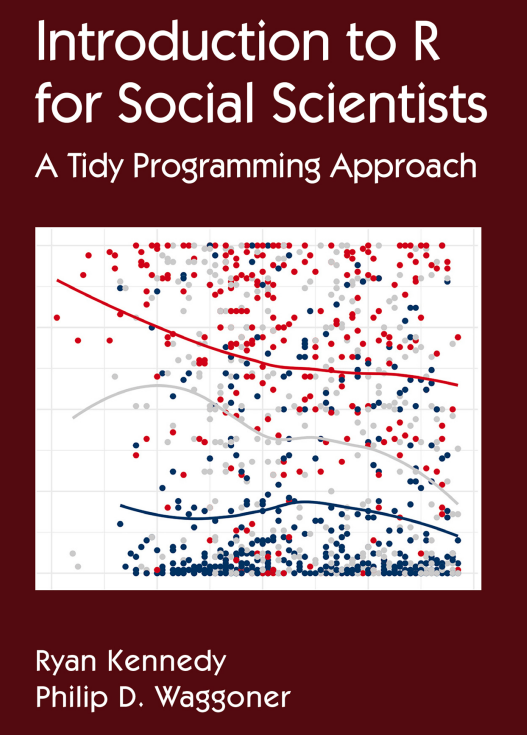

layout: true

background-image: url(figures/template_middlepage_2.png)
background-size: cover

```{r libririesandcustoms, include=FALSE, warning=FALSE}
  library(xaringanthemer)
  library(icons)
  colors = c(
    red = "#f34213",
    purple = "#3e2f5b",
    orange = "#ff8811",
    green = "#136f63",
    white = "#FFFFFF",
    midnightblue = "#191970"
  )
```

---
### .orange[`r icons::fontawesome("info-circle")` Informações Gerais sobre o Curso]

- <p class="jst">Materiais disponibilizados via <A href="https://classroom.google.com/u/0/c/NjExMjg5MTU0OTY3">Classroom</A>;</p> 
- <p class="jst">O aprendizado requer a prática que será constante nas aulas;</p>

.pull-left[
Bibliografia Básica:

 .tiny2[- <p class="jst">Kennedy, R., & Waggoner, P. D. (2021). Introduction to r for social scientists: a tidy programming approach. CRC Press.</p>

```{r out.width = '39%', echo=FALSE, fig.align = "center"}
 
```
]
]

.pull-right[
Bibliografia Complementar:

 .tiny2[- <p class="jst">Wickham, H., Çetinkaya-Rundel, M., & Grolemund, G. (2023). R for data science (2e): import, tidy, transform, visualize, and model data. "O'Reilly Media, Inc.". Disponível em: <A href="https://r4ds.hadley.nz/">https://r4ds.hadley.nz/</A>. Acesso em: 14 de junho, 2023. (Online) </p>
- <p class="jst">Damiani, A. et. al., (2022). Ciência de Dados em R. Curso-R. Disponível em: <A href="https://livro.curso-r.com">https://livro.curso-r.com</A>. Acesso em: 12 de maio, 2023. (Online)</p>
-  <p class="jst">de Aquino, J. A. (2014). R para cientistas sociais. Editora da UESC (editus). Disponível em: <A href="http://www.uesc.br/editora/index.php?item=conteudo_livros_digitais.php">http://www.uesc.br/editora/</A>. Acesso em: 12 de maio, 2023. </p>
-  <p class="jst">de Oliveira, P. F., Guerra, S., McDonnell, R. (2018). Ciência de Dados com R: Introdução. Editora IBPAD. Disponível em: <A href="https://cdr.ibpad.com.br/index.html">https://cdr.ibpad.com.br/index.html</A>. Acesso em: 12 de maio, 2023. (Online) </p> ] 
]

---

### .orange[Nas últimas aulas vimos:]

- <p class="jst">Aquisição de dados da PNADC por meio do pacote .purple[<b>PNADcIBGE</b>] e construção do plano amostral.</p>
- <p class="jst">Geração de estatísticas com .purple[<b>survey/srvyr</b>].</p>
- <p class="jst">Manipulação de dados da PNADC usando .purple[<b>dplyr</b>] e geração de estatísticas considerando ponderação por pesos dos domicílios e das pessoas.</p>
- <p class="jst">Manipulação de dados da PNADC usando .purple[<b>dplyr</b>] em combinação com .purple[<b>survey/srvyr</b>], ou seja, considerando o plano amostral.</p>
- <p class="jst">Geração de gráficos com .purple[<b>survey</b>] e .purple[<b>ggplot2</b>].</p>

</br>
.center[
> <b>Agora trataremos da visualização espacial de dados</b>
]

---
### .orange[`r icons::ionicons("bar-chart-outline")` Visualização de `r icons::fontawesome("table")` dados - Relembrando]

<p class="jst"> A visualização de gráficos pode ser crucial para a fase de análise exploratória de dados - obter informações, entender os dados, relações entre variáveis, desenvolver ou validar hipóteses. Não obstante, também é importante em etapas posteriores de comunicação e divulgação - em relatórios, documentos científicos, páginas na internet, entre outros. </p>

<p class="jst"> O R possui como pacote gráfico básico o .purple[<b>graphics</b>] (vem pré-instalado). Outros pacotes gráficos são:</p>

- <p class="jst">Gráficos estáticos: <A href="https://ggplot2.tidyverse.org/">.purple[<b>ggplot2</b>]</A>  (gráficos de tipos diversos), <A href="https://lattice.r-forge.r-project.org/">.purple[<b>lattice</b>]</b></A>  (gráficos essencialmente do tipo <i>trellis</i>);</p>
- <p class="jst">Gráficos interativos: <A href="https://plotly.com/r/">.purple[<b>plotly</b>]</b></A>, <A href="https://rstudio.github.io/dygraphs/">.purple[<b>dygraphs</b>]</b></A>, <A href="https://jkunst.com/highcharter/">.purple[<b>highcharter</b>]</A>, <A href="https://ggvis.rstudio.com/">.purple[<b>ggvis</b>]</A>, <A href="https://gganimate.com/">.purple[<b>gganimate</b>]</A> (gera animações);</p>
- <u><p class="jst">Mapas estáticos:</u> .purple[<b>graphics</b>], <A href="https://ggplot2.tidyverse.org/">.purple[<b>ggplot2</b>]</A>, <A href="https://cran.r-project.org/web/packages/sp/index.html">.purple[<b>sp</b>]</A>, <A href="https://r-spatial.github.io/sf/">.purple[<b>sf</b>]</A>, <A href="https://r-tmap.github.io/tmap/">.purple[<b>tmap</b>]</A>, <A href="https://github.com/dkahle/ggmap">.purple[<b>ggmap</b>]</A>;</p>
- <u><p class="jst">Mapas interativos:</u> <A href="https://gganimate.com/">.purple[<b>gganimate</b>]</A>, <A href="https://rstudio.github.io/leaflet/">.purple[<b>leaflet</b>]</A>, <A href="https://r-spatial.github.io/mapview/">.purple[<b>mapview</b>]</A>, <A href="https://r-tmap.github.io/tmap/">.purple[<b>tmap</b>]</A>, <A href="https://plotly.com/r/">.purple[<b>plotly</b>]</b></A>;</p>
- <p class="jst">Gráficos 3D:   .purple[<b>graphics</b>], <A href="https://plotly.com/r/">.purple[<b>plotly</b>]</b></A>, <A href="http://www.sthda.com/english/wiki/impressive-package-for-3d-and-4d-graph-r-software-and-data-visualization">.purple[<b>plot3d</b>]</A>, <A href="http://www.sthda.com/english/wiki/scatterplot3d-3d-graphics-r-software-and-data-visualization">.purple[<b>scatterplot3d</b>]</A>, <A href="https://lattice.r-forge.r-project.org/">.purple[<b>lattice</b>]</b></A>, <A href="https://cran.r-project.org/web/packages/rgl/index.html">.purple[<b>RGL</b>]</A>, <A href="https://github.com/coolbutuseless/ggrgl">.purple[<b>ggrgl</b>]</A>,  <A href="https://www.rayshader.com/">.purple[<b>rayshader</b>]</A>, <A href="https://www.rayrender.net/">.purple[<b>rayrender</b>]</A>  (cenas 3D).</p>

<p class="jst"><b>A visualização geoespacial de dados agrega interpretabilidade às informações, permitindo a combinação de dados e metadados com subdivisões geográficas. Para isso, trabalharemos principalmente com .purple[<b>ggplot2</b>].</b></p>  

---
### .orange[`r icons::ionicons("bar-chart-outline")` Visualização de `r icons::fontawesome("table")` dados - .purple[<b>ggplot2</b>] - Relembrando]

<b>Os cinco componentes de um gráfico segundo a interpretação de "Layered Grammar"</i> no .purple[<b>ggplot2</b>] são:</b>

1. Camada(s) - representação visual das propriedades físicas dos dados:
  - Dados (<i><b>data</b></i>);
  - Mapeamento de objetos (<i><b>aesthetic</b></i>) - define as variáveis que compõem o gráfico; divisões categóricas dos dados que são traduzidas em cores, formatos e tamanhos; elementos da legenda e agrupamentos;
  - <u>Geometria dos objetos (<i><b>geom</b></i></u>) - basicamente o tipo do gráfico;
  - Transformações estatísticas (<i><b>stat</b></i>) - basicamente sumarização de dados;
  - Posicionamento (<i><b>position</b></i>) - permite o deslocamento dos elementos gráficos, se houver sobreposição.
  
2. <p class="jst">Escalas  (<i><b>scales</b></i>) - permite o controle sobre atributos estéticos como cores, formas e tamanhos dos elementos geométricos, espaçamento e disposição dos <i>labels</i> nos eixos e legenda, entre outros.</p>
3. <u>Sistema de coordenadas (<i><b>coord</b></i></u>) - permite definir posição/aparência dos objetos mapeados no plano.

4. <p class="jst">Facetamento/tabulamento (<i><b>faceting</b></i>) - gera painéis contendo subdivisões dos dados baseadas em informações categóricas. Os subgráficos compartilham os mesmos atributos estéticos.</p>

5. Tema (<i><b>theme</b></i>) - Define elementos gerais como cor do plano de fundo, tamanho de texto e tipo de fonte.


---
### .orange[`r icons::fontawesome("globe")` Visualização espacial de dados `r icons::fontawesome("table")` - .purple[<b>ggplot2</b>]]

O .purple[<b>ggplot2</b>] permite a produção de mapas estáticos segundo algumas <A href="https://ggplot2-book.org/maps.html"> possibilidades</A>:

- Representação de mapas e dados por meio de polígonos:
  - Funções comulmente usadas: .purple[geom_polygon()], .purple[geom_map()], .purple[coord_map()] e .purple[coord_quickmap()].
  - Requer variáveis que indiquem as coordenadas dos vértices dos polígonos.
  - Talvez o uso seja mais simples, porém, é menos flexível nas representações espaciais.
  - Possui limitações entre os tipos de projeções existentes (Observe em <A href="https://homepage.divms.uiowa.edu/~luke/classes/STAT4580-2021/maps.html">link 1</A> e <A href="https://rpubs.com/scalon/1045452">link 2</A>). 
  
- Representação de mapas e dados por meio de objetos espaciais conhecidos como <i>"simple features"</i>:
  - Funções comulmente usadas: .purple[geom_sf()] e .purple[coord_sf()].
  - Flexibilidade em representações espaciais (ex: pontos, linhas e polígonos).
  - Padronização seguida pela <i>Open Geospatial Consortium</i>.
  - Diversidade/facilidade  entre os tipos de projeções existentes (Observe em <A href="https://semba-blog.netlify.app/01/26/2020/world-map-and-map-projections/">link 1</A> e <A href="https://www.happykhan.com/posts/map-projections-in-r/">link 2</A>).

<p class="jst"> <b>Observação</b>: Em uma projeção, queremos mapear o globo terrestre para uma superfície plana, o que envolve tranformações de coordenadas (latitudes e longitudes) da superficie esférica para a plana. Existem diversas formas de projeções possíveis (ex: cilíndrica, conica, plana, Robinson e Mollweide).</p>

---
### .orange[`r icons::fontawesome("globe")` Visualização espacial de dados `r icons::fontawesome("table")` - .purple[<b>ggplot2</b>]]

A visualização espacial pode ser dividida em duas etapas:

- Obter um conjunto de dados de um mapa base.

- Adicionar/mapear os dados e metadados que nos interessam ao mapa base.

Existem diversos pacotes no r que fornecem mapas:
- Representação por meio de polígonos: .purple[<b>maps</b>].

- Representação por meio de objetos <A href="https://r-spatial.github.io/sf/">.purple[<b>sf</b>]</A> (17 tipos de <i>"simple features"</i>): .purple[<b>rnaturalearth</b>], .purple[<b>geobr</b>].

- Representação por meio de objetos <A href="https://cran.r-project.org/web/packages/sp/index.html">.purple[<b>sp</b>]</A> (pontos, grades, linhas, anéis e polígonos): .purple[<b>rworldmap</b>], .purple[<b>rworldxtra</b>], .purple[<b>spData</b>].

<p class="jst">Existem diversos pacotes no r que permitem manipulação e análise de objetos e dados espaciais (ex: .purple[<b>sf</b>], .purple[<b>sp</b>], .purple[<b>raster</b>], .purple[<b>terra</b>]). Não obstante, começamos por carregar o .purple[<b>ggplot2</b>] e outros pacotes do .purple[<b>tidyverse</b>].</p>

```{r include=FALSE}
  library(tidyverse)
```

```{r, eval=FALSE}
  install.packages("tidyverse")
  library(tidyverse)
```

---
### .orange[`r icons::fontawesome("globe")` Visualização espacial de dados `r icons::fontawesome("table")` - .purple[<b>ggplot2</b>]]

<p class="jst">Vejamos exemplos de mapas construídos com polígonos. Carregamos um mapa base do pacote .purple[<b>maps</b>], usando a função .purple[ggplot2::map_data()]:</p>

```{r, message=FALSE}
  # install.packages("maps")
  library(maps)
  world_map <- map_data("world")
```

<p class="jst"> Podemos gerar esse mapa simples, conforme o código abaixo. A variável <b>group</b> possui os códigos individuais dos países, que indicamos no atributo estético, de mesmo nome, para unir os vértices dos polígonos (coordenadas das colunas <b>long</b> e <b>lat</b>), ou seja, para gerar as divisas territoriais de cada país. Fixamos o preenchimento dos polígonos na cor cinza e as fronteiras como linhas pretas.</p>

```{r p1a, message=FALSE, eval=FALSE, cache=TRUE}
  ggplot(data = world_map, aes(x = long, y = lat, group = group)) +
    geom_polygon(fill="lightgray", color = "black") +
    labs(title = "Mapa Global", x = "Longitude", y = "Latitude") +
    theme_bw()
```

---
class: left, top
### .orange[`r icons::fontawesome("globe")` Visualização espacial de dados `r icons::fontawesome("table")` - .purple[<b>ggplot2</b>]]

```{r p1a_out, cache=TRUE, ref.label="p1a", echo=FALSE, warning=FALSE, message=FALSE, fig.align='center', out.height= "500px", out.width="800px"}
```

---
### .orange[`r icons::fontawesome("globe")` Visualização espacial de dados `r icons::fontawesome("table")` - .purple[<b>ggplot2</b>]]

Vejamos como filtrar e produzir um mapa dos países da América do Sul.

```{r p1bdata, message=FALSE, cache=TRUE}
  south_america <- c("Brazil", "Argentina", "Chile", "Uruguay", "Paraguay", "Ecuador",
                     "Peru", "Venezuela", "Colombia", "Bolivia", "Suriname", "Guyana")
  south_america_countries <- filter(world_map, region %in% south_america)
  south_america_labels <- summarise(south_america_countries,
                                    long = mean(long), lat = mean(lat), .by = region)
```

<p class="jst">Agora, o preenchimento dos polígonos de cada país ocorrerá com as cores básicas do .purple[<b>ggplot2</b>], ao indicar a variável <b>region</b>. Os contornos serão em linhas brancas. Com .purple[geom_text()], posicionaremos os nomes dos países (coluna <b>region</b>) como <i>labels</i>, cujas coordenadas foram calculadas como a média das longitudes e latitudes (vértices) dos polígonos.</p>

```{r p1b, message=FALSE, eval=FALSE, cache=TRUE}
  ggplot(data = south_america_countries, aes(x = long, y = lat)) +
    geom_polygon(aes(group = group, fill = region), color = "white", alpha = .9) +
    geom_text(data = south_america_labels, aes(label = region),
              size = 3.5, fontface = 2, color = "gray20", angle = 20, check_overlap = TRUE) +
    labs(title = "Países da América do Sul", x = "Longitude", y = "Latitude") +
    theme_bw() + theme(legend.position = "none")
```

---
class: left, top
### .orange[`r icons::fontawesome("globe")` Visualização espacial de dados `r icons::fontawesome("table")` - .purple[<b>ggplot2</b>]]

```{r p1b_out, cache=TRUE, ref.label="p1b", echo=FALSE, warning=FALSE, message=FALSE, fig.align='center', out.height= "500px", out.width="600px"}
```


---
### .orange[`r icons::fontawesome("globe")` Visualização espacial de dados `r icons::fontawesome("table")` - .purple[<b>ggplot2</b>]]


<p class="jst">Como já temos o mapa base, podemos  adicionar/mapear dados ao mesmo. Como exemplo, vamos adquirir dados de expectativa de vida da <i>World Health Organization</i> usando o pacote .purple[<b>WHO</b>]. Este pacote não está disponível no <b>CRAN</b>, mas podemos instalá-lo direto do seu repositório no GitHub através de .purple[<b>devtools</b>].</p>

```{r, eval=FALSE}
  # From Github
  library(devtools)
  install_github("expersso/WHO")
```

<p class="jst"> Agora, obtemos os dados de expectativa de vida do ano de 2019, fazendo algumas alterações, conforme:</p>

```{r expectativa_vida, cache = TRUE , warning=FALSE}
  library(WHO)
  expectativa_de_vida <- get_data("WHOSIS_000001") |>
    filter(year == 2019) |>
    rename(region_at = region, region = country, life_exp = value) |>
    mutate(region = ifelse(region == "United States of America", "USA", region)) 
```

<p class="jst">A coluna <b>region</b> contém os nomes dos países e estará presente tanto no conjunto de dados do mapa quanto no de expectativa de vida. Assim, podemos estabelecer uma relação entre as tabelas.</p> 

---
### .orange[`r icons::fontawesome("globe")` Visualização espacial de dados `r icons::fontawesome("table")` - .purple[<b>ggplot2</b>]]

Podemos gerar um mapa com .purple[geom_map()], mapeando os dados de expectativa de vida, na forma:

```{r p1c, message=FALSE, eval=FALSE, cache=TRUE}
  expectativa_de_vida |> 
    filter(sex == "Both sexes") |>
  ggplot() +
    geom_map(aes(fill = life_exp, map_id = region), map = world_map, color = "black") + 
    expand_limits(x = world_map$long, y = world_map$lat) +
    scale_fill_viridis_c(option = "C") +
    labs(title = "Expectativa de vida em diversos países do mundo em 2019.",
         x = "", y = "", caption = "Fonte: Organização Mundial da Saúde.") +
    theme_bw() + theme(legend.title = element_blank())
```

<p class="jst">A função .purple[expand_limits()] é necessaria para indicar as coordenadas nos eixos do mapa a ser gerado, já que as latitudes e longitudes não estão presentes nos dados de expectativa de vida.</p>

---
class: left, top
### .orange[`r icons::fontawesome("globe")` Visualização espacial de dados `r icons::fontawesome("table")` - .purple[<b>ggplot2</b>]]

```{r p1c_out, cache=TRUE, ref.label="p1c", echo=FALSE, warning=FALSE, message=FALSE, fig.align='center', out.height= "400px", out.width="800px"}
```

---
### .orange[`r icons::fontawesome("globe")` Visualização espacial de dados `r icons::fontawesome("table")` - .purple[<b>ggplot2</b>]]

Podemos unir os dados com o mapa base e gerar a visualização com .purple[geom_polygon()] ou .purple[geom_map()]:

```{r p1d, message=FALSE, eval=FALSE, cache=TRUE}
  my_map <- left_join(expectativa_de_vida, world_map, by = "region") # unindo os conjuntos
  my_title <- "Expectativa de vida (homens e mulheres) em diversos países, no ano de 2019."
  my_cap <- "Fonte: Organização Mundial da Saúde."
  my_map |> 
    filter(sex != "Both sexes") |>
  ggplot(aes(long, lat, group = group)) +
    geom_polygon(aes(fill = life_exp ), color = "black") + facet_wrap(~sex, nrow = 2) +
    scale_fill_viridis_c(option = "C") +
    labs(title = my_title, x = "", y = "", caption = my_cap) +
    theme_bw() +
    theme(legend.title = element_blank()) # ou usando geom_map()
```

```{r, eval=FALSE}
  my_map |> filter(sex != "Both sexes") |>
  ggplot(aes(long, lat, fill = life_exp, map_id = region)) +
    geom_map(map = my_map, color = "black") + facet_wrap(~sex, nrow = 2) +
    scale_fill_viridis_c(option = "C") +
    labs(title = my_title, x = "", y = "", caption = my_cap) +
    theme_bw() + theme(legend.title = element_blank())
```


---
class: left, top
### .orange[`r icons::fontawesome("globe")` Visualização espacial de dados `r icons::fontawesome("table")` - .purple[<b>ggplot2</b>]]

```{r p1d_out, cache=TRUE, ref.label="p1d", echo=FALSE, warning=FALSE, message=FALSE, fig.align='center', fip.cap="Fonte: Organização Mundial da Saúde..", out.height= "500px", out.width="800px"}
```

---
### .orange[`r icons::fontawesome("globe")` Visualização espacial de dados `r icons::fontawesome("table")` - .purple[<b>ggplot2</b>]]

<p class="jst">Agora, veremos exemplos de mapas baseados em <i>"simple features"</i>. O pacote <A href="https://r-spatial.github.io/sf/">.purple[<b>sf</b>]</A>, em específico, possui uma diversidade de representações espaciais, operações geométricas, transformações de projeção e suporte para outras bibliotecas geoespaciais. Para os exemplos, obteremos um mapa através dos pacotes .purple[<b>rnaturalearth</b>] e .purple[<b>rnaturalearthdata</b>]:</p>

```{r, message=FALSE, eval=FALSE}
  install.packages(c("rnaturalearth", "rnaturalearthdata"))
  # Pacotes auxiliares para gráficos do ggplot2
  install.packages(c("ggrepel", "ggspatial"))
```

```{r, message=FALSE}
  library(sf)
  library(rnaturalearth)
  library(rnaturalearthdata)
  library(ggrepel)   # permite evitar a sobreposição de textos usados como labels
  library(ggspatial) # fornece anotações (ex: escala) e outras operações em mapas
```

Carregamos o mapa base usando a função .purple[rnaturalearth::ne_countries()]:
```{r pre01, cache=TRUE}
  world_map <- ne_countries(scale = "medium", returnclass = "sf")
```

---
### .orange[`r icons::fontawesome("globe")` Visualização espacial de dados `r icons::fontawesome("table")` - .purple[<b>ggplot2</b>]]

.pull-left[

Podemos gerar o mapa, na forma:

```{r p2a, message=FALSE, eval=FALSE, cache=TRUE}
  ggplot(data = world_map) +
    geom_sf(fill="lightgray",
            color = "black") +
    coord_sf(expand = FALSE) +
    labs(title = "Mapa Global") +
    theme_bw()
```

<p class="jst">A função .purple[coord_sf(expand = FALSE)] é necessária - nesse caso específico - para não expandir os limites do mapa, tornando possível  a visualização dos <i>labels</i> das coordenadas.</p>

]

.pull-right[

```{r p2a_out, cache=TRUE, ref.label="p2a", echo=FALSE, warning=FALSE, message=FALSE, fig.align='top'}
```

]

---
### .orange[`r icons::fontawesome("globe")` Visualização espacial de dados `r icons::fontawesome("table")` - .purple[<b>ggplot2</b>]]

<p class="jst"> Para produzir um mapa da América do Sul, filtramos os dados usando a variável <b>continent</b>. Como o pacote .purple[<b>sf</b>] possui operações sobre objetos geométricos, podemos calcular os centros dos multi-polígonos que representam os países (coluna <b>geometry</b>) e converter para coordenadas (latitudes e longitudes). Estas serão usadas para posicionar os nomes dos países como <i>labels</i> no mapa com a função .purple[geom_text_repel()], que corrigirá, caso ocorra, sobreposições entre os textos.</p>

```{r p2b, message=FALSE, eval=FALSE, cache=TRUE}
  world_map |> 
    filter(continent == "South America")  |>
    mutate(lon = sf::st_coordinates(sf::st_centroid(geometry))[,1],
           lat = sf::st_coordinates(sf::st_centroid(geometry))[,2]) |>
  ggplot() +
    geom_sf(aes(fill = name, alpha = .9), color = "black") +
    geom_text_repel(aes(lon, lat, label = name), size = 3.5, fontface = 2, color = "gray20") +
    labs(title = "América do Sul", x = "", y = "") +
    theme_bw() +  theme(legend.position = "none")    
```

---
class: left, top
### .orange[`r icons::fontawesome("globe")` Visualização espacial de dados `r icons::fontawesome("table")` - .purple[<b>ggplot2</b>]]

```{r p2b_out, cache=TRUE, ref.label="p2b", echo=FALSE, warning=FALSE, message=FALSE, fig.align='center', out.height= "500px", out.width="600px"}
```

---
### .orange[`r icons::fontawesome("globe")` Visualização espacial de dados `r icons::fontawesome("table")` - .purple[<b>ggplot2</b>]]

.pull-left[

<p class="jst">O mapa base que baixamos já possui informações anexas. Observe:</p>

```{r p2c, message=FALSE, eval=FALSE, cache=TRUE}
t1 = "Distribuição da População"
sub1 = "Censos entre 2000 e 2011"
world_map |> filter(lastcensus >= 2000) |>
ggplot() +
  geom_sf(aes(fill = pop_est * 10^-9),
          color = "white") +
  coord_sf(expand = FALSE) +
  scale_y_continuous(limits = c(-80, 80)) +
  scale_fill_viridis_c(
    option = "C",
    name = "Bilhões de Habitantes") +
  labs(title = t1, subtitle = sub1) +
  theme_bw() +
  theme(legend.direction = "horizontal",
        legend.position = "bottom",
        legend.key.width = unit(2,"cm"))
```

]

.pull-right[

```{r p2c_out, cache=TRUE, ref.label="p2c", echo=FALSE, warning=FALSE, message=FALSE, fig.align='center', out.height= "400px", out.width="600px"}
```

]

---
### .orange[`r icons::fontawesome("globe")` Visualização espacial de dados `r icons::fontawesome("table")` - .purple[<b>ggplot2</b>]]

.pull-left[

<p class="jst">Podemos facilmente mudar a projeção com .purple[coord_sf()]. Observe:</p>

```{r p2d, message=FALSE, eval=FALSE, cache=TRUE}
t2 = "Distribuição do PIB"
world_map |> subset(lastcensus >= 2000) |>
ggplot() +
  geom_sf(aes(fill = gdp_md_est * 10^-6),
          color = "white") +
  coord_sf(crs = "+proj=robin") +
  scale_fill_viridis_c(
    option = "C",
    name = "Trilhões de Dolares (US$)") +
  labs(title = t2, subtitle = sub1) +
  theme_bw() +
  theme(legend.direction = "horizontal",
        legend.position = "bottom",
        legend.key.width = unit(2,"cm"))
```

]

.pull-right[

```{r p2d_out, cache=TRUE, ref.label="p2d", echo=FALSE, warning=FALSE, message=FALSE, fig.align='center', out.height= "400px", out.width="600px"}
```

]

---
### .orange[`r icons::fontawesome("globe")` Visualização espacial de dados `r icons::fontawesome("table")` - .purple[<b>ggplot2</b>]]

<p class="jst">Vimos algumas formas de produzir mapas. Sem embargo, o uso de objetos do tipo <i>"simple features"</i> junto ao .purple[<b>ggplot2</b>] tem se tornado predominante pela flexibilidade e disponibilidade de operações sobre mapas e dados. Seguiremos essa linha. Também precisamos de mapas do Brasil, portanto, usaremos o pacote <A href="https://github.com/ipeaGIT/geobr".purple[<b>geobr</b>]</A>:</p>

```{r, include=FALSE}
  library(geobr)
```

```{r, eval=FALSE}
  install.packages("geobr")
  library(geobr)
```

<p class="jst">O pacote .purple[<b>geobr</b>] fornece mapas de divisões territoriais do Brasil e outros conjuntos de dados, conforme às funções que disponibiliza - ex: .purple[read_state()], .purple[read_municipality()] e .purple[read_health_facilities()]. Veja, por exemplo, a obtenção do mapa da cidade de Santa Maria segundo a ocupação territorial:</p>

```{r p2e, cache=TRUE, message=FALSE, eval=FALSE}
  censo_sm <- geobr::read_census_tract(code_tract = 4316907, year = 2020, showProgress = FALSE)
  ggplot(data = censo_sm, aes(fill=zone)) +
    geom_sf() +
    labs(title = "Ocupação Territorial de Santa Maria-RS", caption = "Fonte: IBGE") +
    theme_bw() + theme(legend.title = element_blank(),
                       legend.direction = "vertical", legend.position = "bottom")
```

---
class: left, top
### .orange[`r icons::fontawesome("globe")` Visualização espacial de dados `r icons::fontawesome("table")` - .purple[<b>ggplot2</b>]]

```{r p2e_out, cache=TRUE, ref.label="p2e", echo=FALSE, warning=FALSE, message=FALSE, fig.align='center', out.height= "400px", out.width="700px"}
```

</br>
> .center[<b>A partir de agora, trabalharemos com dados da PNADC.</b>]

---
### .orange[Microdados da PNAD Contínua `r icons::ionicons("bar-chart-outline")` - Relembrando]

<p class="jst">Para trabalhar com os microdados da PNAD Contínua, vamos fazer uso dos pacotes: </p>

- <A href="https://cran.r-project.org/web/packages/PNADcIBGE/index.html">.purple[<b>PNADcIBGE</b>]</A> - possibilita baixar dados da PNAD Contínua.
- <A href="https://cran.r-project.org/web/packages/survey/index.html">.purple[<b>survey</b>]</A> - possibilita produzir diversas operações estatísticas em dados com amostragem complexa.
- <A href="https://cran.r-project.org/web/packages/srvyr/index.html">.purple[<b>srvyr</b>]</A> - uma extensão do pacote .purple[<b>survey</b>] que permite o uso de funções do .purple[<b>dplyr</b>] e sua sintaxe.


Vamos instalar e carregar os pacotes:

```{r, message=FALSE, eval=FALSE}
  install.packages(c("PNADcIBGE", "survey", "srvyr"))
```

```{r, message=FALSE}
  library(PNADcIBGE)
  library(survey)
  library(srvyr)
```

```{r, echo=FALSE}
options(OutDec=",", scipen=100, digits=4, big.mark = ".")
```

---
### .orange[Microdados da PNAD Contínua `r icons::ionicons("bar-chart-outline")` - Relembrando]

<p class="jst">Continuaremos trabalhando com microdados do primeiro trimestre de 2023, que podem ser baixados/carregados usando funções do pacote .purple[<b>PNADcIBGE</b>].</p>

- Baixar e carregar os dados:

```{r, eval=FALSE}  
  # Baixar os dados
  get_pnadc(year = 2023, quarter = 1, savedir = "PNADC20231") 
```

---
### .orange[Microdados da PNAD Contínua `r icons::ionicons("bar-chart-outline")` - Relembrando]

- Carregar os dados dos arquivos:

```{r chunk1, cache=TRUE, include=FALSE}
  # Lendo os dados, excluindo os pesos replicados e mantendo alguns códigos numéricos
  pnadc_2023q1 <- read_pnadc(
                    microdata = "../dados/PNADC20231/PNADC_012023.txt",
                    input_txt = "../dados/PNADC20231/input_PNADC_trimestral.txt"
                  ) |>
    select(-(V1028001:V1028200)) |>      
    mutate(code_state = as.numeric(UF), 
           code_capital = as.numeric(Capital),
           anos_de_estudo = as.numeric(VD3005)) |>
    pnadc_labeller(dictionary.file = "../dados/PNADC20231/dicionario_PNADC_microdados_trimestral.xls") |>
    pnadc_deflator(deflator.file = "../dados/PNADC20231/deflator_PNADC_2023_trimestral_040506.xls") |>
    mutate(VD4020_real = VD4020 * Efetivo,
           VD4019_habitual = VD4019 * Habitual) 
```

```{r, eval=FALSE}
  # Lendo os dados, excluindo os pesos replicados e mantendo alguns códigos numéricos
  pnadc_2023q1 <- read_pnadc(
                    microdata = "PNADC20231/PNADC_012023.txt",
                    input_txt = "PNADC20231/input_PNADC_trimestral.txt"
                  ) |>
    select(-(V1028001:V1028200)) |>      
    mutate(code_state = as.numeric(UF), 
           code_capital = as.numeric(Capital),
           anos_de_estudo = as.numeric(VD3005)) |>
    pnadc_labeller(dictionary.file = "PNADC20231/dicionario_PNADC_microdados_trimestral.xls") |>
    pnadc_deflator(deflator.file = "PNADC20231/deflator_PNADC_2023_trimestral_040506.xls") |>
    mutate(VD4020_real = VD4020 * Efetivo,
           VD4019_habitual = VD4019 * Habitual)
```

---
### .orange[Microdados da PNAD Contínua `r icons::ionicons("earth-outline")` - visualização espacial]

Obtemos o mapa do Brasil e a localização das capitais usando funções do pacote .purple[<b>geobr</b>]:

```{r chunk10, cache=TRUE, message=FALSE}
  estados_br <- read_state(year = 2020, showProgress = FALSE)
  capitais_br <- read_capitals(showProgress = FALSE) |> 
    mutate(code_state = as.numeric(code_state))
```

```{r}
  glimpse(estados_br)
```

</br>
Perceba que o conjunto de dados do mapa possui o código dos estados (coluna <b>code_state</b>).

---
### .orange[Microdados da PNAD Contínua `r icons::ionicons("earth-outline")` - visualização espacial]

<p class="jst">Agora, como exemplo, podemos gerar as estimativas do rendimento médio mensal real efetivo das pessoas com 14 anos ou mais de idade, segundo o nível de instrução (<b>VD3004</b>) e unidade da federação (<b>code_state</b>). Não aplicaremos o plano amostral, mas sim, a média ponderada pelo peso dos domicílios e das pessoas (<b>V1028</b>):</p>

```{r chunk11, cache=TRUE}
  rendimento_mensal <- pnadc_2023q1 |>
    summarise(rendimento_medio = weighted.mean(VD4020_real, w = V1028, na.rm = TRUE), 
              .by = c(code_state, VD3004)) |> 
    drop_na()
```

```{r chunk12, cache=TRUE}
  glimpse(rendimento_mensal)
```

</br>
O conjunto de dados gerado também possui o código dos estados.
---
### .orange[Microdados da PNAD Contínua `r icons::ionicons("earth-outline")` - visualização espacial]

<p class="jst">Propositadamente, mantivemos no conjunto de dados a variável <b>code_state</b>, usada como agrupamento na geração da estatística. Dessa forma, podemos unir o mapa base com os dados de rendimento médio mensal real efetivo e gerar o seguinte gráfico:</p>

```{r p3a, message=FALSE, eval=FALSE}
  my_cap = "Fonte: Dados da PNADC do IBGE, 1° trimestre 2023."
  left_join(estados_br, rendimento_mensal, by = "code_state") |>
    filter(VD3004 == "Superior completo") |>
  ggplot() +
    geom_sf(aes(fill = rendimento_medio), color = "gray20") +
    labs(title = paste0("Rendimento médio mensal real efetivo do morador\ncom nível ",
                        "superior completo por estado."), caption = my_cap) + 
    scale_fill_distiller(palette = "Spectral", name = "Rendimento Médio") +
    theme_minimal() + theme(plot.title = element_text(size = 11, face = 'bold')) +
    ggspatial::annotation_scale()
```

---
class: left, top
### .orange[Microdados da PNAD Contínua `r icons::ionicons("earth-outline")` - visualização espacial]

```{r p3a_out, cache=TRUE, ref.label="p3a", echo=FALSE, warning=FALSE, message=FALSE, fig.align='center', out.height= "500px", out.width="800px"}
```

---
### .orange[Microdados da PNAD Contínua `r icons::ionicons("earth-outline")` - visualização espacial]

<p class="jst">Também podemos gerar mapas de distribuição do rendimento, conforme o nível de instrução:</p>

```{r p3b, message=FALSE, eval=FALSE}
  left_join(estados_br, rendimento_mensal, by = "code_state") |>
  ggplot() +
    geom_sf(aes(fill = rendimento_medio), color = "gray20") + 
    facet_wrap(~VD3004) +
    labs(title = paste0("Rendimento médio mensal real efetivo do morador com 14 anos\n",
                        "ou mais de idade por nível de instrução e unidade da federação."),
         caption = my_cap) +
    scale_fill_distiller(palette = "Spectral", name = "Rendimento Médio") +
    theme_classic() +
    theme(axis.text = element_blank(),
          axis.title = element_blank(),
          axis.ticks = element_blank(),
          strip.text = element_text(size = 6, face = "bold"),
          plot.title = element_text(size = 11, face = "bold"))
```

---
class: left, top
### .orange[Microdados da PNAD Contínua `r icons::ionicons("earth-outline")` - visualização espacial]

```{r p3b_out, cache=TRUE, ref.label="p3b", echo=FALSE, warning=FALSE, message=FALSE, fig.align='center', out.height= "500px", out.width="800px"}
```

---
### .orange[Microdados da PNAD Contínua `r icons::ionicons("earth-outline")` - visualização espacial]

<p class="jst">Vamos gerar também estimativas do rendimento médio mensal real efetivo e anos de estudo por estado e para as capitais. Usamos a função .purple[st_sf()], após as demais operações, para converter o objeto gerado na junção dos conjuntos de dados ao tipo <b>sf</b>.</p>

```{r chunk13, cache=TRUE}
  estados <- pnadc_2023q1 |> 
    summarise(rendimento_medio = weighted.mean(VD4020_real, w = V1028, na.rm = TRUE),
              anos_de_estudo = weighted.mean(anos_de_estudo, w = V1028, na.rm = TRUE),
              .by = "code_state") |>
    drop_na() |> 
    right_join(estados_br, by = "code_state") |> st_sf()
```

```{r chunk14, cache=TRUE}
  capitais <- pnadc_2023q1 |>
    summarise(rendimento_medio = weighted.mean(VD4020_real, w = V1028, na.rm = TRUE),
              anos_de_estudo = weighted.mean(anos_de_estudo, w = V1028, na.rm = TRUE),
              .by = "code_capital") |> 
    drop_na() |>
    right_join(capitais_br, by = c("code_capital" = "code_state")) |> st_sf()
```

---
### .orange[Microdados da PNAD Contínua `r icons::ionicons("earth-outline")` - visualização espacial]

Produziremos os seguintes gráficos:

```{r p3c, message=FALSE, eval=FALSE}
  my_title <- paste0("Rendimento médio mensal real efetivo e anos de estudo do morador com\n",
                     "14 anos ou mais de idade, nos estados e capitais.")
  my_theme = theme_classic() + theme(axis.text = element_blank(), axis.title = element_blank(),
                   axis.ticks = element_blank(), legend.key.width = unit(1.2,"cm"),
                   legend.position = "bottom", legend.direction = "horizontal")
  p1 <- ggplot(data = estados, aes(fill = rendimento_medio)) +
    geom_sf(color = "gray20") + 
    geom_sf(data = capitais, shape = 22, size = 2) +
    scale_fill_distiller(palette = "Spectral", name = "Rendimento Médio") + my_theme
  p2 <- ggplot(data = estados, aes(fill = anos_de_estudo)) +
    geom_sf(color = "gray20") + 
    geom_sf(data = capitais, shape = 21, size = 2) +
    scale_fill_distiller(palette = "Spectral", name = "Anos de Estudo") + my_theme
  # install.packages("patchwork")
  library(patchwork)
  p1 + p2 + plot_annotation(title = my_title, caption = my_cap)
```

---
### .orange[Microdados da PNAD Contínua `r icons::ionicons("earth-outline")` - visualização espacial]

```{r p3c_out, cache=TRUE, ref.label="p3c", echo=FALSE, warning=FALSE, message=FALSE, fig.align='center', out.height= "500px", out.width="800px"}
```

---
### .orange[Microdados da PNAD Contínua `r icons::ionicons("earth-outline")` - visualização espacial]

<p class="jst"> <b>Distribuição da população por sexo e unidade da federação?</b> Ao somar os valores da coluna <b>V1028</b> (peso dos domicílios e das pessoas), estimamos o total de habitantes da população brasileira em milhões (multiplica-se por 10<sup>-6</sup>, e formataremos usando .purple[label_number()]). Como a estimativa será agregada por sexo e unidade da federação, os totais irão considerar essas divisões categóricas.</p>

```{r p4a, message=FALSE, eval=FALSE}
  pnadc_2023q1 |>
    summarise(total = sum(V1028), .by = c(V2007, code_state)) |>
    right_join(estados_br, by = "code_state") |> 
    st_sf() |>
  ggplot() +
    geom_sf(aes(fill = total), color = "white") + 
    facet_wrap(~V2007) +
    labs(caption = my_cap) +
    scale_fill_viridis_c(option = "C", name = "Distribuição da População", 
                         labels = scales::label_number(suffix = " M", scale = 1e-6)) +
    theme_classic() + my_theme
```

---
### .orange[Microdados da PNAD Contínua `r icons::ionicons("earth-outline")` - visualização espacial]

```{r p4a_out, cache=TRUE, ref.label="p4a", echo=FALSE, warning=FALSE, message=FALSE, fig.align='center', out.height= "500px", out.width="700px"}
```

---
### .orange[Microdados da PNAD Contínua `r icons::ionicons("earth-outline")` - visualização espacial]

<p class="jst"> <b>Número total e proporção da população por sexo e unidade da federação?</b> Podemos agregar somente por estado, para estimar com a função .purple[count()] a distribuição da população segundo o sexo, considerando pesos (<b>wt = V1028</b>). Os valores serão armazenados na variável <b>n</b>, e a proporção pode ser obtida ao dividir o total se cada sexo (<b>n</b>) pela soma dos totais de cada estado (homens + mulheres):</p>

```{r p4b, message=FALSE, eval=FALSE}
  escala1 <-  scale_fill_viridis_c(option = "C", name = "Total",
                                   labels = scales::label_number(suffix = " M", scale = 1e-6))
  escala2 <- scale_fill_viridis_c(option = "C", name = "Proporção", labels = scales::percent) 
  populacao <- pnadc_2023q1 |> 
    group_by(code_state) |>
    count(V2007, wt = V1028) |>
    mutate(proporcao = n/sum(n)) |>
    right_join(estados_br, by = "code_state") |> st_sf()
  p1 <- ggplot(data = populacao) + geom_sf(aes(fill = n), color = "white") +
    facet_wrap(~V2007) + escala1 + my_theme
  p2 <- ggplot(data = populacao) + geom_sf(aes(fill = proporcao), color = "white") + 
    facet_wrap(~V2007) + escala2 + my_theme
  p1 / p2 + plot_annotation(title = "Distribuição da população.",
                            caption = my_cap)
```

---
### .orange[Microdados da PNAD Contínua `r icons::ionicons("earth-outline")` - visualização espacial]

```{r p4b_out, cache=TRUE, ref.label="p4b", echo=FALSE, warning=FALSE, message=FALSE, fig.align='center', out.height= "500px", out.width="700px"}
```

---
### .orange[Microdados da PNAD Contínua `r icons::ionicons("earth-outline")` - visualização espacial]

<p class="jst"> <b>Número total e proporção das pessoas com 60 anos ou mais de idade por unidade da federação?</b></p>

```{r p4b2, message=FALSE, eval=FALSE}
  populacao <- pnadc_2023q1 |> 
    group_by(code_state) |>
    count(V2009 > 60, wt = V1028) |>
    mutate(proporcao = n/sum(n)) |>
    right_join(estados_br, by = "code_state") |> st_sf()
  p1 <- ggplot(data = filter(populacao, `V2009 > 60` == TRUE)) +
    geom_sf(aes(fill = n), color = "white") + escala1 + my_theme
  p2 <- ggplot(data = filter(populacao, `V2009 > 60` == TRUE)) +
    geom_sf(aes(fill = proporcao), color = "white") + escala2 + my_theme
  p1 / p2 + plot_annotation(
              title = "Distribuição da população com idade\nigual ou superior a 60 anos.",
              caption = my_cap
            )
```

---
### .orange[Microdados da PNAD Contínua `r icons::ionicons("earth-outline")` - visualização espacial]

```{r p4b2_out, cache=TRUE, ref.label="p4b2", echo=FALSE, warning=FALSE, message=FALSE, fig.align='center', out.height= "500px", out.width="700px"}
```

---
### .orange[Microdados da PNAD Contínua `r icons::ionicons("earth-outline")` - visualização espacial]

<b>Número total e proporção dos trabalhadores, segundo a condição de ocupação?</b>

```{r p4c, message=FALSE, eval=FALSE}
  my_title = "Condição da Força de Trabalho."
  my_subtitle = "(A,B) Ocupados, (C,D) Desocupados, (E, F) Não aplicável"
  my_theme = theme_classic() + theme(axis.text = element_blank(), axis.title = element_blank(),
                                     axis.ticks = element_blank())
  forca_trabalho <-   pnadc_2023q1 |> group_by(code_state) |> count(VD4002, wt = V1028) |> 
    mutate(proporcao = n/sum(n) ) |> right_join(estados_br, by = "code_state") |> st_sf()
  p <- ggplot(data = filter(forca_trabalho, VD4002 == "Pessoas ocupadas")) 
  p1 <- p + geom_sf(aes(fill = n), color = "white") + escala1 + my_theme
  p2 <- p + geom_sf(aes(fill = proporcao), color = "white") + escala2 + my_theme
  p <- ggplot(data = filter(forca_trabalho, VD4002 == "Pessoas desocupadas"))
  p3 <- p + geom_sf(aes(fill = n), color = "white") + escala1 + my_theme
  p4 <- p + geom_sf(aes(fill = proporcao), color = "white") + escala2 + my_theme
  p <- ggplot(data = filter(forca_trabalho, is.na(VD4002)))
  p5 <- p + geom_sf(aes(fill = n), color = "white") + escala1 + my_theme
  p6 <- p + geom_sf(aes(fill = proporcao), color = "white") + escala2 + my_theme
 (p1 + p2) / (p3 + p4) / (p5 + p6) + plot_annotation(tag_levels = 'A', title = my_title,
                                         subtitle = my_subtitle, caption = my_cap)
```

---
### .orange[Microdados da PNAD Contínua `r icons::ionicons("earth-outline")` - visualização espacial]

```{r p4c_out, cache=TRUE, ref.label="p4c", echo=FALSE, warning=FALSE, message=FALSE, fig.align='center', out.height= "500px", out.width="700px"}
```

---
### .orange[Microdados da PNAD Contínua `r icons::ionicons("earth-outline")` - visualização espacial]

<p class="jst"> <b>Número total e proporção dos subocupados (insuficiência de horas habitualmente trabalhadas) por unidade da federação?</b></p>

```{r p4d, message=FALSE, eval=FALSE}
  populacao <- pnadc_2023q1 |> 
    group_by(code_state) |>
    count(condicao = VD4004A, wt = V1028) |> 
    mutate(proporcao = n/sum(n)) |>
    filter(condicao == "Pessoas subocupadas") |>
    right_join(estados_br, by = "code_state") |> st_sf()
  p1 <- ggplot(data = populacao) +
    geom_sf(aes(fill = n), color = "white") + 
    scale_fill_viridis_c(option = "C", name = "Total") + my_theme
  p2 <- ggplot(data = populacao) +
    geom_sf(aes(fill = proporcao), color = "white") + escala2 + my_theme
  p1 / p2 + plot_annotation(title = "Subocupados no Brasil.",
                            caption = my_cap)
```

---
### .orange[Microdados da PNAD Contínua `r icons::ionicons("earth-outline")` - visualização espacial]

```{r p4d_out, cache=TRUE, ref.label="p4d", echo=FALSE, warning=FALSE, message=FALSE, fig.align='center', out.height= "500px", out.width="700px"}
```

---
### .orange[Microdados da PNAD Contínua `r icons::ionicons("earth-outline")` - visualização espacial]

<p class="jst"> <b>Número total e proporção dos desalentados por unidade da federação?</b></p>

```{r p4e, message=FALSE, eval=FALSE}
  populacao <- pnadc_2023q1 |> 
    group_by(code_state) |>
    count(condicao = VD4005, wt = V1028) |> 
    mutate(proporcao = n/sum(n)) |>
    filter(condicao == "Pessoas desalentadas") |>
    right_join(estados_br, by = "code_state") |> st_sf()
  p1 <- ggplot(data = populacao) + 
    geom_sf(aes(fill = n), color = "white") + 
    scale_fill_viridis_c(option = "C", name = "Total") + my_theme
  p2 <- ggplot(data = populacao) + 
    geom_sf(aes(fill = proporcao), color = "white") + escala2 + my_theme
  p1 / p2 + plot_annotation(title = "Desalentados no Brasil.",
                          caption = my_cap)
```

---
### .orange[Microdados da PNAD Contínua `r icons::ionicons("earth-outline")` - visualização espacial]

```{r p4e_out, cache=TRUE, ref.label="p4e", echo=FALSE, warning=FALSE, message=FALSE, fig.align='center', out.height= "500px", out.width="700px"}
```

---
### .orange[Microdados da PNAD Contínua `r icons::ionicons("earth-outline")` - visualização espacial]

<b>Proporção da população, com idade igual ou superior a 25 anos, por estado e segundo o nível de instrução?</b>

```{r p4f, message=FALSE, eval=FALSE}
  my_theme2 <-  theme_classic() +
    theme(axis.text = element_blank(), axis.title = element_blank(),
          axis.ticks = element_blank(), strip.text = element_text(size = 6, face = "bold"),
          legend.direction = "horizontal", legend.position = "bottom",
          legend.key.width = unit(1.2,"cm"))
  pnadc_2023q1 |>
    filter(V2009 >= 25) |> 
    group_by(code_state) |>
    count(VD3004, wt = V1028) |>
    mutate(proporcao = n/sum(n)) |>
    right_join(estados_br, by = "code_state") |> drop_na() |> st_sf() |>
  ggplot() + 
    geom_sf(aes(fill = proporcao), color = "gray20") + facet_wrap(~VD3004) +
    scale_fill_distiller(palette = "Spectral",
                         name = paste0("Proporção da População (25 anos ou mais de idade)",
                                       "\npor Nível de Instrução."), labels = scales::percent) +
    labs(caption = my_cap) + my_theme2
```

---
### .orange[Microdados da PNAD Contínua `r icons::ionicons("earth-outline")` - visualização espacial]

```{r p4f_out, cache=TRUE, ref.label="p4f", echo=FALSE, warning=FALSE, message=FALSE, fig.align='center', out.height= "500px", out.width="700px"}
```

---
### .orange[Microdados da PNAD Contínua `r icons::ionicons("earth-outline")` - visualização espacial]

<b>Parcela da população nos níveis de instrução: "Sem instrução e menos de 1 ano de estudo", "Superior completo"?</b>

```{r, p4g, message=FALSE, eval=FALSE}
  my_title = "Parcela da população (25 anos ou mais de idade):"
  my_subtitle = "(A,B) Sem instrução e menos de 1 ano de estudo, (C,D) Superior completo"
  nivel_instrucao <- pnadc_2023q1 |>
    filter(V2009 >= 25) |>
    group_by(code_state) |>
    count(VD3004, wt = V1028) |>
    mutate(proporcao = n/sum(n) ) |>
    right_join(estados_br, by = "code_state") |> st_sf()
  p <- ggplot(data = filter(nivel_instrucao, 
                            VD3004 == "Sem instrução e menos de 1 ano de estudo"))  
  p1 <- p + geom_sf(aes(fill = n), color = "white") + escala1 + my_theme
  p2 <- p + geom_sf(aes(fill = proporcao), color = "white") + escala2 + my_theme
  p <- ggplot(data = filter(nivel_instrucao, VD3004 == "Superior completo"))
  p3 <- p + geom_sf(aes(fill = n), color = "white") + escala1 + my_theme
  p4 <- p + geom_sf(aes(fill = proporcao), color = "white") + escala2 + my_theme
 (p1|p2)/(p3+p4) + plot_annotation(tag_levels = 'A', title = my_title, subtitle = my_subtitle,
                                   caption = my_cap)
```

---
### .orange[Microdados da PNAD Contínua `r icons::ionicons("earth-outline")` - visualização espacial]

```{r p4g_out, cache=TRUE, ref.label="p4g", echo=FALSE, warning=FALSE, message=FALSE, fig.align='center', out.height= "500px", out.width="700px"}
```

---
### .orange[Microdados da PNAD Contínua `r icons::ionicons("earth-outline")` - visualização espacial]

<p class="jst"> <b>Situação do analfabetismo das pessoas com 15 anos ou mais de idade por unidade da federação?</b></p>

```{r p4h, message=FALSE, eval=FALSE}
  populacao <- pnadc_2023q1 |>
    filter(V2009 >= 15) |> 
    group_by(code_state) |>
    count(sabe_ler = V3001, wt = V1028) |>
    mutate(proporcao = n/sum(n)) |>
    filter(sabe_ler == "Não") |>
    right_join(estados_br, by = "code_state") |> st_sf()
  p1 <- ggplot(populacao) + geom_sf(aes(fill = n), color = "white") + 
    scale_fill_viridis_c(option = "C", name = "Total") + my_theme
  p2 <- ggplot(populacao) + geom_sf(aes(fill = proporcao), color = "white") +
    escala2 + my_theme
  p1 / p2 + plot_annotation(title = paste0("Analfabetismo no Brasil ",
                                           "(pessoas com 15 anos ou mais de idade)."),
                          caption = my_cap)
```

---
### .orange[Microdados da PNAD Contínua `r icons::ionicons("earth-outline")` - visualização espacial]

```{r p4h_out, cache=TRUE, ref.label="p4h", echo=FALSE, warning=FALSE, message=FALSE, fig.align='center', out.height= "500px", out.width="700px"}
```

---
### .orange[Microdados da PNAD Contínua `r icons::ionicons("earth-outline")` - visualização espacial]

<p class="jst">Vamos ver exemplos mais elaborados para produzir gráficos painelizados. Antes, produziremos um conjunto de dados com o total e a proporção das pessoas segundo o nível de curso que frequentam.</p>

```{r p4idata, cache=TRUE, message=FALSE}
  my_theme = theme_classic() + 
    theme(axis.text = element_blank(), axis.title = element_blank(), 
          axis.ticks = element_blank(), legend.position = "bottom",
          legend.direction = "horizontal", legend.key.width = unit(.6,"cm"),
          legend.text = element_text(size = 5), legend.title = element_text(size=7),
          strip.text = element_text(size = 7))
  populacao <- pnadc_2023q1 |>  
    group_by(code_state) |>
    count(curso = as.character(V3003A), wt = V1028) |>
    mutate(proporcao = n/sum(n),
           curso = case_when(
             curso == "Educação de jovens e adultos (EJA) do ensino fundamental" ~ 
               "EJA - ensino fundamental",
             curso == "Educação de jovens e adultos (EJA) do ensino médio" ~
               "EJA - ensino médio", 
             .default = curso)
    ) |> right_join(estados_br, by = "code_state") |> st_sf()
```

---
### .orange[Microdados da PNAD Contínua `r icons::ionicons("earth-outline")` - visualização espacial]

<p class="jst"><b>Qual o total populacional cursando cada nível de ensino por unidade da federação?</b> Para isso, dividiremos nossos dados com a função .purple[base::split()], segundo o nível de ensino. Depois, usaremos a função .purple[purrr::map()] para mapear cada divisão categórica (nível do curso) do conjunto de dados no respectivo paínel gráfico, gerado pelo .purple[ggplot()]. Dessa forma, as escalas serão geradas individualmente para cada paínel - comportamento aqui almejado. Ainda precisamos da função .purple[cowplot::plot_grid()] para recompor os painéis individuais em um único gráfico.</p>

```{r p4i, message=FALSE, eval=FALSE}
  # install.packages("cowplot")
  populacao %>%  
    split(.$curso) %>%
    purrr::map(
      ~ ggplot(., aes(fill = n)) +
          geom_sf() +
          facet_wrap(~curso) +
          escala1 + my_theme
    ) %>%
    cowplot::plot_grid(plotlist = .)
```

---
### .orange[Microdados da PNAD Contínua `r icons::ionicons("earth-outline")` - visualização espacial]

```{r p4i_out, cache=TRUE, ref.label="p4i", echo=FALSE, warning=FALSE, message=FALSE, fig.align='center', out.height= "500px", out.width="1000px"}
```

---
### .orange[Microdados da PNAD Contínua `r icons::ionicons("earth-outline")` - visualização espacial]

<b>Qual a proporção da população cursando cada nível de ensino por unidade da federação?</b>

```{r p4j, message=FALSE, eval=FALSE}
  populacao %>% 
    split(.$curso) %>%
    purrr::map(
      ~ ggplot(., aes(fill = proporcao)) +
          geom_sf() +
          facet_wrap(~curso) +
          escala2 + my_theme
    ) %>%
    cowplot::plot_grid(plotlist = .)    
```

---
### .orange[Microdados da PNAD Contínua `r icons::ionicons("earth-outline")` - visualização espacial]

```{r p4j_out, cache=TRUE, ref.label="p4j", echo=FALSE, warning=FALSE, message=FALSE, fig.align='center', out.height= "500px", out.width="1000px"}
```

---
### .orange[Microdados da PNAD Contínua `r icons::ionicons("earth-outline")` - visualização espacial]

Agora, vamos aplicar o plano amostral com .purple[<b>PNADcIBGE</b>], mas antes selecionamos algumas variáveis:

```{r chunk_survey1, cache=TRUE, message=FALSE}
  pnadc_2023q1 <- pnadc_2023q1 |> 
    select(Ano, Trimestre, UF, code_state, Capital, Estrato, UPA, posest, V1027, V1028, V1029,
           V2009, VD3004, anos_de_estudo, VD4019_habitual, VD4020_real, ID_DOMICILIO)
```


```{r chunk_survey2, cache=TRUE, message=FALSE}
  pnadc_2023q1 <- PNADcIBGE::pnadc_design(data_pnadc = pnadc_2023q1)
```

<p class="jst">O pacote .purple[<b>convey</b>] (documentação <A href="https://guilhermejacob.github.io/context/index.html">online</b></A>) permite estimar diversas medidas de concentração de renda e desigualdade em dados com amostragem complexa como o índice de Gini. Vamos carregar esse pacote e preparar os dados, sendo necessário converter o tipo do objeto com a função .purple[convey::convey_prep()]</p>

```{r, include=FALSE}
  library(convey)
```

```{r, eval=FALSE}
  install.packages("convey")
  library(convey)
```

```{r chunk_survey3, cache=TRUE, message=FALSE}
  pnadc_2023q1 <- convey_prep(design = pnadc_2023q1)
```

---
### .orange[Microdados da PNAD Contínua `r icons::ionicons("earth-outline")` - visualização espacial]

<p class="jst"><b>Assim, podemos calcular o índice de Gini do rendimento médio mensal real por unidade da federação e gerar um mapa.</b> Para isso, usaremos a função .purple[svyby()] com o parâmetro <b>FUN</b> = .purple[convey::svygini()]. O índice de Gini irá variar entre 0 e 1 quanto a concentração de renda: 0 = máxima igualdade e 1 = máxima desigualdade.</p>

```{r p6a, message=FALSE, eval=FALSE}
  svyby(formula = ~VD4020_real, by = ~code_state, design = pnadc_2023q1, 
        FUN = svygini, na.rm = TRUE) |>
    right_join(estados_br, by = "code_state") |> st_sf() |>
  ggplot() + 
    geom_sf(aes(fill = VD4020_real), color = "gray20") +
    scale_fill_distiller(
      palette = "Spectral",
      name = "Índice de Gini do rendimento médio mensal real efetivo\npor unidade da federação."
    ) +
    labs(caption = my_cap) + my_theme2
```

---
### .orange[Microdados da PNAD Contínua `r icons::ionicons("earth-outline")` - visualização espacial]

```{r p6a_out, cache=TRUE, ref.label="p6a", echo=FALSE, warning=FALSE, message=FALSE, fig.align='center', out.height= "500px", out.width="700px"}
```

---
### .orange[Microdados da PNAD Contínua `r icons::ionicons("earth-outline")` - visualização espacial]

<p class="jst"><b>Vamos calcular o índice de Gini por unidade da federação, considerando cada nível de instrução.</b> Combinamos as funções .purple[svyby()] e .purple[interaction()] para obter os agrupamentos desejados. Esta última permite o cruzamento de duas ou mais variáveis categóricas e produzirá a coluna <b>interaction(code_state, VD3004)</b>, contendo as combinações possíveis. Após a geração da estatística, extrairemos com .purple[gsub()] os níveis categóricos originais, armazenando os valores nas colunas <b>code_state</b> e <b>instrucao</b>, conforme.</p>

```{r p6b, message=FALSE, eval=FALSE}
  svyby(formula = ~VD4020_real, by = ~interaction(code_state, VD3004), design = pnadc_2023q1,
        FUN = svygini, na.rm = TRUE) |>
    mutate(code_state = as.numeric(gsub("\\D", "", `interaction(code_state, VD3004)`)),
           instrucao = gsub(".*\\.", "", `interaction(code_state, VD3004)`)) |>
    right_join(estados_br, by = "code_state") |> st_sf() |>
  ggplot() + 
    geom_sf(aes(fill = VD4020_real), color = "gray20") + facet_wrap(~instrucao) +
    scale_fill_distiller(
      palette = "Spectral",
      name = paste0("Índice de Gini do rendimento médio mensal real efetivo\n",
                    "por unidade da federação e nível de instrução.")
    ) + 
    labs(caption = my_cap) + my_theme2
```

---
### .orange[Microdados da PNAD Contínua `r icons::ionicons("earth-outline")` - visualização espacial]

```{r p6b_out, cache=TRUE, ref.label="p6b", echo=FALSE, warning=FALSE, message=FALSE, fig.align='center', out.height= "500px", out.width="700px"}
```

---
### .orange[Microdados da PNAD Contínua `r icons::ionicons("earth-outline")` - visualização espacial]

<p class="jst"><b>Também podemos calcular o índice de Gini referente à educação (anos de estudo) por unidade da federação.</b> Consideraremos a média de anos estudo das pessoas com 25 anos ou mais de idade:</b></p>

```{r p6c, message=FALSE, eval=FALSE}
  svyby(formula = ~anos_de_estudo, by = ~code_state, design = subset(pnadc_2023q1, V2009 >= 25),
        FUN = svygini, na.rm = TRUE) |>
    right_join(estados_br, by = "code_state") |> st_sf() |>
  ggplot() + 
    geom_sf(aes(fill = anos_de_estudo), color = "gray20") +
    scale_fill_distiller(
      palette = "Spectral",
      name = "Índice de Gini para a Educação por Unidade da Federação."
    ) +
    labs(caption = my_cap) + my_theme2
```

---
### .orange[Microdados da PNAD Contínua `r icons::ionicons("earth-outline")` - visualização espacial]

```{r p6c_out, cache=TRUE, ref.label="p6c", echo=FALSE, warning=FALSE, message=FALSE, fig.align='center', out.height= "500px", out.width="700px"}
```

---
### .orange[Microdados da PNAD Contínua `r icons::ionicons("earth-outline")` - visualização espacial]

<p class="jst">Agora, vamos obter microdados anuais acumulados na 5ª entrevista do ano de 2022, conforme:</p>

- Baixar os dados:

```{r, eval=FALSE}
  get_pnadc(year = 2022, interview = 5, savedir = "PNADC2022IT5")
```

---
### .orange[Microdados da PNAD Contínua `r icons::ionicons("earth-outline")` - visualização espacial]

- Carregar os dados dos arquivos:

```{r chunk_survey4, cache=TRUE, include=FALSE}
  # Lendo os dados, excluindo os pesos replicados e mantendo alguns códigos numéricos
  pnadc_2022_it5 <- read_pnadc(
                    microdata = "../dados/PNADC2022IT5/PNADC_2022_visita5.txt",
                    input_txt = "../dados/PNADC2022IT5/input_PNADC_2022_visita5_20230811.txt",
                    vars = c("Ano", "Trimestre", "UF", "Capital", "UPA", "Estrato", "V1008", "V1014",
                             "V1030", "V1031", "V1032", "V1034", "posest", "posest_sxi",
                             "V2003", "V2009", "VD3004", "VD3005", "VD5005")) |>
    select(-(V1032001:V1032200)) |>
    mutate(code_state = as.numeric(UF), 
           code_capital = as.numeric(Capital),
           anos_de_estudo = as.numeric(VD3005)) |>
    pnadc_labeller(
      dictionary.file = "../dados/PNADC2022IT5/dicionario_PNADC_microdados_2022_visita5_20230811.xls"
    ) |>
    pnadc_deflator(deflator.file = "../dados/PNADC2022IT5/deflator_PNADC_2022.xls") |>
    mutate(VD5005_real = VD5005 * CO1e) |> # CO1e é o deflator para rendimento efetivo
    PNADcIBGE::pnadc_design() |> convey::convey_prep()
```

```{r, eval=FALSE}
  # Ler variáveis específicas, excluir os pesos replicados e manter alguns códigos numéricos
  pnadc_2022_it5 <- read_pnadc(
                    microdata = "PNADC2022IT5/PNADC_2022_visita5.txt",
                    input_txt = "PNADC2022IT5/input_PNADC_2022_visita5_20230811.txt", 
                    vars = c("Ano", "Trimestre", "UF", "Capital", "UPA", "Estrato",
                             "V1008", "V1014", "V1030", "V1031", "V1032", "V1034",
                             "posest", "posest_sxi", "V2003", "V2009",
                             "VD3004", "VD3005", "VD5005")) |>
    select(-(V1032001:V1032200)) |>
    mutate(code_state = as.numeric(UF), 
           code_capital = as.numeric(Capital),
           anos_de_estudo = as.numeric(VD3005)) |>
    pnadc_labeller(
      dictionary.file = "PNADC2022IT5/dicionario_PNADC_microdados_2022_visita5_20230811.xls"
    ) |>
    pnadc_deflator(deflator.file = "PNADC2022IT5/deflator_PNADC_2022.xls") |>
    mutate(VD5005_real = VD5005 * CO1e) |> # obter o rendimento efetivo corrigido
    PNADcIBGE::pnadc_design() |> convey::convey_prep()
```


---
### .orange[Microdados da PNAD Contínua `r icons::ionicons("earth-outline")` - visualização espacial]

<p class="jst">Com o novo conjunto de dados, podemos calcular o índice de Gini do rendimento médio mensal real domiciliar per capita (<b>VD5005_real</b>) por unidade da federação e gerar uma visualização espacial, conforme:</p>

```{r p6d, message=FALSE, eval=FALSE}
  svyby(formula = ~VD5005_real, by = ~code_state, design = pnadc_2022_it5, 
        FUN = svygini, na.rm = TRUE) |>
    right_join(estados_br, by = "code_state") |> st_sf() |>
  ggplot() + 
    geom_sf(aes(fill = VD5005_real), color = "gray20") +
    scale_fill_distiller(
      palette = "Spectral",
      name = paste0("Índice de Gini do rendimento médio mensal real domiciliar per capta,",
                    "\na preços médios do ano, por unidade da federação.")
    ) +
    labs(caption = "Fonte: PNADC do IBGE, 2022.") + my_theme2
```

---
### .orange[Microdados da PNAD Contínua `r icons::ionicons("earth-outline")` - visualização espacial]

```{r p6d_out, cache=TRUE, ref.label="p6d", echo=FALSE, warning=FALSE, message=FALSE, fig.align='center', out.height= "500px", out.width="700px"}
```

---
### .orange[Microdados da PNAD Contínua `r icons::ionicons("earth-outline")` - visualização espacial]

<p class="jst"><b>Com a função .purple[convey::svyarpt()], podemos calcular os valores limiares de rendimento para o risco de pobreza (60% da mediana do rendimento) em cada estado.</b> Rendimentos abaixo desses limiares podem indicar pessoas em risco de pobreza. Visualizaremos esses valores limiares em um mapa, conforme:

```{r p6e, message=FALSE, eval=FALSE}
  svyby(formula = ~VD5005_real, by = ~code_state, design = pnadc_2022_it5, 
      FUN = svyarpt, na.rm = TRUE) |>
    right_join(estados_br, by = "code_state") |> st_sf() |>
    ggplot() + geom_sf(aes(fill = VD5005_real), color = "gray20") +
    scale_fill_distiller(
      palette = "Spectral",
      name = paste0("Limiar do rendimento médio mensal real domiciliar per capta para",
                    "\no risco de pobreza em cada estado, a preços médios do ano.")
    ) +
    labs(caption = "Fonte: PNADC do IBGE, 2022.") + my_theme2
```

---
### .orange[Microdados da PNAD Contínua `r icons::ionicons("earth-outline")` - visualização espacial]

```{r p6e_out, cache=TRUE, ref.label="p6e", echo=FALSE, warning=FALSE, message=FALSE, fig.align='center', out.height= "500px", out.width="700px"}
```

---
### .orange[Microdados da PNAD Contínua `r icons::ionicons("earth-outline")` - visualização espacial]

<p class="jst"><b>Com a função .purple[convey::svyarpr()], podemos calcular a proporção da população sob risco de pobreza em cada unidade da federação.</b> Serão considerados os rendimentos limiares de cada estado para estimar essa parcela da população. </p>

```{r p6f, message=FALSE, eval=FALSE}
  svyby(formula = ~VD5005_real, by = ~code_state, design = pnadc_2022_it5, 
        FUN = svyarpr, na.rm = TRUE) |>
    right_join(estados_br, by = "code_state") |> st_sf() |>
    ggplot() + 
    geom_sf(aes(fill = VD5005_real), color = "gray20") +
    scale_fill_distiller(
      palette = "Spectral",
      name = paste0("Proporção da população sob risco\nde pobreza em cada estado."),
      labels = scales::percent
    ) +
    labs(caption = "Fonte: PNADC do IBGE, 2022.") + my_theme2
```

---
### .orange[Microdados da PNAD Contínua `r icons::ionicons("earth-outline")` - visualização espacial]

```{r p6f_out, cache=TRUE, ref.label="p6f", echo=FALSE, warning=FALSE, message=FALSE, fig.align='center', out.height= "500px", out.width="700px"}
```

---
### .orange[Microdados da PNAD Contínua `r icons::ionicons("earth-outline")` - visualização espacial]

<p class="jst"><b>Podemos estimar a proporção da população em risco de pobreza por unidade da federação.</b> No entanto, o limiar de rendimento será um valor único, calculado em nível nacional, conforme:</p>

```{r p6g, message=FALSE, eval=FALSE}
  escala3 <-  scale_fill_distiller(palette = "Spectral", name = "Total",
                                   labels = scales::label_number(suffix = " M", scale = 1e-6))
  escala4 <- scale_fill_distiller(palette = "Spectral", name = "Proporção",
                                  labels = scales::percent) 
  risco_pobreza_br <- svyarpt(~VD5005_real, pnadc_2022_it5, na.rm = TRUE)
  populacao <- pnadc_2022_it5$variables |> group_by(code_state) |>
    count(sob_pobreza = VD5005_real <= risco_pobreza_br, wt = V1032) |>
    mutate(proporcao = n/sum(n)) |> filter(sob_pobreza == TRUE) |> 
    right_join(estados_br, by = "code_state") |> st_sf()
  p1 <- ggplot(data = populacao) + geom_sf(aes(fill = n), color = "black") 
  p2 <- ggplot(data = populacao) + geom_sf(aes(fill = proporcao), color = "black")
  (p1 + escala3 + my_theme2) + (p2 + escala4 + my_theme2) +
  plot_annotation(
    title = paste0("População em risco de pobreza, cujo rendimento médio mensal real ",
                   "domiciliar\nper capta esta abaixo de ", round(risco_pobreza_br, digits = 2),
                   " reais."), caption = "Fonte: PNADC do IBGE, 2022.")
```

---
### .orange[Microdados da PNAD Contínua `r icons::ionicons("earth-outline")` - visualização espacial]

```{r p6g_out, cache=TRUE, ref.label="p6g", echo=FALSE, warning=FALSE, message=FALSE, fig.align='center', out.height= "500px", out.width="700px"}
```

---
### .orange[Fontes Adicionais de Dados de Interesse Social]

<p class="jst">Existem outros pacotes no r que fornecem acesso simplificado a dados como:</p>

- <p class="jst">Pacote <A href="https://ipeagit.github.io/censobr/index.html">.purple[<b>censobr</b>]</A>  - dados de censos demográficos.</p>

- <p class="jst">Pacote <A href="https://electionsbr.com/">.purple[<b>electionsBR</b>]</A> - dados do TSE sobre eleições no Brasil.</p>

- <p class="jst">Pacote <A href="https://github.com/rfsaldanha/microdatasus">.purple[<b>microdatasus</b>]</A> - dados do Sistema Único de Saúde do Brasil (SUS), fornecidos pelo departamento de informática do SUS - o DATASUS. Obs: Este pacote não está disponível no CRAM, sendo necessário instalá-lo através de repositório no GitHub.</p>


---
### .orange[Dados Domésticos do Censo IBGE `r icons::ionicons("earth-outline")` - visualização espacial]

<p class="jst">O pacote .purple[<b>censobr</b>] (documentação <A href="https://ipeagit.github.io/censobr/index.html">online</b></A>) permite baixar dados de censos demográficos realizados no Brasil. Vamos ver alguns exemplos de obtenção e visualização desses dados. Primeiro, instalamos e carregamos o pacote:</p> 

```{r, include=FALSE}
  library(censobr)
```

```{r, eval=FALSE}
  install.packages("censobr"); library(censobr);
```

<p class="jst">Focaremos em dados domésticos de residências, que são baixados com .purple[censobr::read_households()]: </p>
 
```{r p5data1, cache=TRUE, message=FALSE}
  domestico_br <- read_households(year = 2010, add_labels = 'pt', showProgress = FALSE)
```

<p class="jst">O objeto <b>domestico_br</b> ainda não possui os dados de domicílios. Como o pacote .purple[<b>censobr</b>] foi implementado considerando o pacote .purple[<b>arrow</b>] (provém armazenamento, manipulação e acesso remoto de dados), o objeto  <b>domestico_br</b> permite baixar dados conforme à demanda do usuário - questão importante devido às possíveis limitações computacionais (principalmente memória RAM) e a grande quantidade de dados censitários.</p>

```{r}
  class(domestico_br)
```

---
### .orange[Dados Domésticos do Censo IBGE `r icons::ionicons("earth-outline")` - visualização espacial]

<p class="jst">Já que podemos baixar variáveis específicas, devemos conhecer os dados. Para fazer consultas, basta usar a função .purple[censobr::data_dictionary()].</p>

```{r, eval = FALSE}
  data_dictionary(2010, 'households')
```

<p class="jst">Vamos obter dados sobre o tipo de esgotamento sanitário (variável <b>V0207</b>) disponível nos domicílios, calculando o total e a proporção de cada tipo nos municípios. É necessário considerar o peso amostral (variável <b>V0010</b>). Com a função .purple[dplyr::collect()], coletamos nossos dados, que são fornecidos pelo objeto <b>domestico_br</b>, observe:</p>

```{r p5data2, cache=TRUE, message=FALSE}
  esgotamento_sanitario <- domestico_br |> 
    collect() |>
    group_by(code_muni) |>                                          
    count(tipo = V0207, wt = V0010) |>      
    mutate(proporcao = n / sum(n)) |> 
    collect()  
```

---
### .orange[Dados Domésticos do Censo IBGE `r icons::ionicons("earth-outline")` - visualização espacial]

<p class="jst">Também vamos obter o mapa do Brasil com a divisão territorial dos municípios:</p>

```{r p5data3, cache=TRUE, message=FALSE}
  municipios_br <- geobr::read_municipality(year = 2010, showProgress = FALSE) |> 
    mutate(code_muni = as.character(code_muni))
```

Agora, produziremos mapas dos dados, conforme:

```{r p5a, message=FALSE, eval=FALSE}
  left_join(esgotamento_sanitario, municipios_br, by = "code_muni") |>
    st_sf() |>
    drop_na() |>
  ggplot(aes(fill = proporcao)) +
            geom_sf(linewidth = 0) +
            facet_wrap(~tipo) +
            escala4 + my_theme 
```


---
### .orange[Dados Domésticos do Censo IBGE `r icons::ionicons("earth-outline")` - visualização espacial]

```{r p5a_out, cache=TRUE, ref.label="p5a", echo=FALSE, warning=FALSE, message=FALSE, fig.align='center', out.height= "500px", out.width="700px"}
```


---
### .orange[Dados Domésticos do Censo IBGE `r icons::ionicons("earth-outline")` - visualização espacial]

<p class="jst">Podemos gerar mapas com outros pacotes gráficos, como o <A href="https://r-tmap.github.io/tmap/">.purple[<b>tmap</b>]</A>.</p> 

```{r, include=FALSE}
  library(tmap)
```

```{r, eval=FALSE}
  install.packages(c("lwgeom", "tmap"))
  library(tmap)
```

Vejamos um exemplo de mapa com os mesmos dados de esgotamento sanitário:

```{r p5b, message=FALSE, eval=FALSE}
  esgotamento_sanitario |> 
    mutate(proporcao = proporcao * 100) |>
    right_join(municipios_br, by = "code_muni") |> 
    st_sf() |> drop_na() |>
  tm_shape() + 
    tmap_options(check.and.fix = TRUE) +
    tm_fill("proporcao", 
            n = 10,
            palette = '-Spectral', 
            title = "Esgotamento Sanitário (%)") + 
    tm_facets(by = "tipo")
```


---
### .orange[Dados Domésticos do Censo IBGE `r icons::ionicons("earth-outline")` - visualização espacial]

```{r p5b_out, cache=TRUE, ref.label="p5b", echo=FALSE, warning=FALSE, message=FALSE, fig.align='center', out.height= "500px", out.width="800px"}
```

---
### .orange[Dados Domésticos do Censo IBGE `r icons::ionicons("earth-outline")` - visualização espacial]

<b>Somente para o estado do Rio grande do sul?</b>

```{r p5c, message=FALSE, eval=FALSE}
  esgotamento_sanitario |> 
    mutate(proporcao = proporcao * 100) |> 
    right_join(y = filter(municipios_br, code_state == 43), by = "code_muni") |> 
    st_sf() |> 
    drop_na() |>
  tm_shape() + 
    tmap_options(check.and.fix = TRUE) +
    tm_fill("proporcao",
            n = 10,
            palette = '-Spectral',
            title = "Esgotamento Sanitário (%)") + 
    tm_facets(by = "tipo")
```


---
### .orange[Dados Domésticos do Censo IBGE `r icons::ionicons("earth-outline")` - visualização espacial]

```{r p5c_out, cache=TRUE, ref.label="p5c", echo=FALSE, warning=FALSE, message=FALSE, fig.align='center', out.height= "500px", out.width="800px"}
```

---
### .orange[Dados Domésticos do Censo IBGE `r icons::ionicons("earth-outline")` - visualização espacial]

<b>Computador com acesso à internet (variável V0220), no estado do Rio grande do sul?</b>

```{r p5d, message=FALSE, eval=FALSE}
  domestico_br |> 
    collect() |>
    group_by(code_muni) |>                                          
    count(acesso_internet = V0220, wt = V0010) |>      
    mutate(proporcao = n / sum(n) * 100) |> 
    collect() |>
    right_join(y = filter(municipios_br, code_state == 43), by = "code_muni") |>
    st_sf() |> 
    drop_na() |>
  tm_shape() + 
    tmap_options(check.and.fix = TRUE) +
    tm_fill("proporcao",
            n = 10,
            palette = '-Spectral',
            title = "Acesso à Internet por\nmeio de Computador (%)") + 
    tm_facets(by = "acesso_internet")
```


---
### .orange[Dados Domésticos do Censo IBGE `r icons::ionicons("earth-outline")` - visualização espacial]

```{r p5d_out, cache=TRUE, ref.label="p5d", echo=FALSE, warning=FALSE, message=FALSE, fig.align='center', out.height= "500px", out.width="800px"}
```

---
### .orange[Visualização Espacial Interativa `r icons::ionicons("earth-outline")`]

<p class="jst">Existem alternativas no r para visualizar mapas interativos e dinâmicos. Para simplificar, podemos continuar usando o pacote .purple[<b>tmap</b>], que fornece visualizações interativas. Veremos um breve exemplo por meio deste <A href="https://tsklipp.github.io/metodologias-informacionais-com-r/scripts/dynamic_maps.html">tutorial</A>.</p>


---
### .orange[Bibliográfia Complementar]

<p class="jst">Há uma diversidade de bons materiais que orientam o uso dos microdados da PNAD Contínua através do R: </p>

- <p class="jst">Documentação <A href="https://rpubs.com/gabriel-assuncao-ibge/pnadc">.purple[online]</A> desenvolvido por um dos criadores do pacote .purple[<b>PNADcIBGE</b>].

- <p class="jst"> Livro  <A href="https://repositorio.ufrn.br/bitstream/123456789/48507/1/PorDentrodaPNADContinua_Trov%C3%A3o_SilvaJ%C3%BAnior_2022.pdf">.purple["POR DENTRO DA PNAD CONTÍNUA: Uma introdução ao tratamento de dados usando o R"]</A>.
- <p class="jst">Curso de R disponível no repositório do Git Hub: <A href="https://github.com/leobarone/cebrap_lab_cetic_programacao_r/tree/master">.purple[Introdução à Programação em R]</b></A>. 
- <p class="jst">Materiais online sobre o pacote .purple[<b>srvyr</b>]: <A href="https://rpubs.com/leobarone/pnadc_srvyr">.purple[Link 1]</A> e <A href="https://rpubs.com/amrofi/microdados_pnadc_srvyr/">.purple[Link 2]</A>.
  
</br>

Documentações para uso dos pacotes: <A href="https://guilhermejacob.github.io/context/index.html">.purple[<b>convey</b></b>]</A>, <A href="https://cran.r-project.org/web/packages/geobr/vignettes/intro_to_geobr.html">.purple[<b>geobr</b>]</A>, <A href="https://cran.r-project.org/web/packages/censobr/vignettes/censobr.html">.purple[<b>censobr</b>]</A>, <A href="http://electionsbr.com/articles/introduction.html">.purple[<b>electionsBR</b>]</A>, <A href="https://github.com/rfsaldanha/microdatasus/wiki">.purple[<b>microdatasus</b>]</A> e <A href="https://cran.r-project.org/web/packages/tmap/vignettes/tmap-getstarted.html">.purple[<b>tmap</b>]</A>.

Livro sobre o pacote <A href="https://r-tmap.github.io/tmap-book/
">.purple[<b>tmap</b>]</A> e <A href="https://rpubs.com/Henriqueufla/tmap_r
">.purple[tutorial]</A> mais curto.

Livro com conteúdo mais avançado sobre manipulação e visualização de geodados: <A href="https://r.geocompx.org/">.purple[Geocomputation with R]</A>.


---
exclude: TRUE
class: left, top

### .orange[Referências]

```{r, load_refs, echo=FALSE}
library(RefManageR)
bib <- ReadBib("./files/02-mybib.bib", check = FALSE)
generateReferences <- function(bib) {
  for(i in 1:length(bib)) { 
    print(bib[i], .opts = list(check.entries = FALSE, style = "html", bib.style = "authoryear"))
  }
}
```

```{r, print_refs, results='asis', echo=FALSE, warning=FALSE, message=FALSE}
writeLines('.small[')
generateReferences(bib)
writeLines(']')
```

---
class: center, middle

background-image: url(figures/template_endpage_2.png)
background-size: contain

.center[.large[<b> Metotologias Informacionais com `r icon_style( icons::simple_icons("r"), scale = 2)`</b> ]]

.xxlarge[<b style="color:MidnightBlue "> Muito Obrigado pela Atenção!</b>]
  
